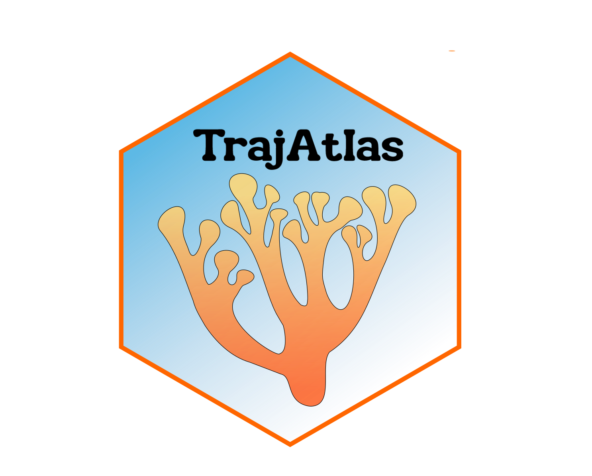
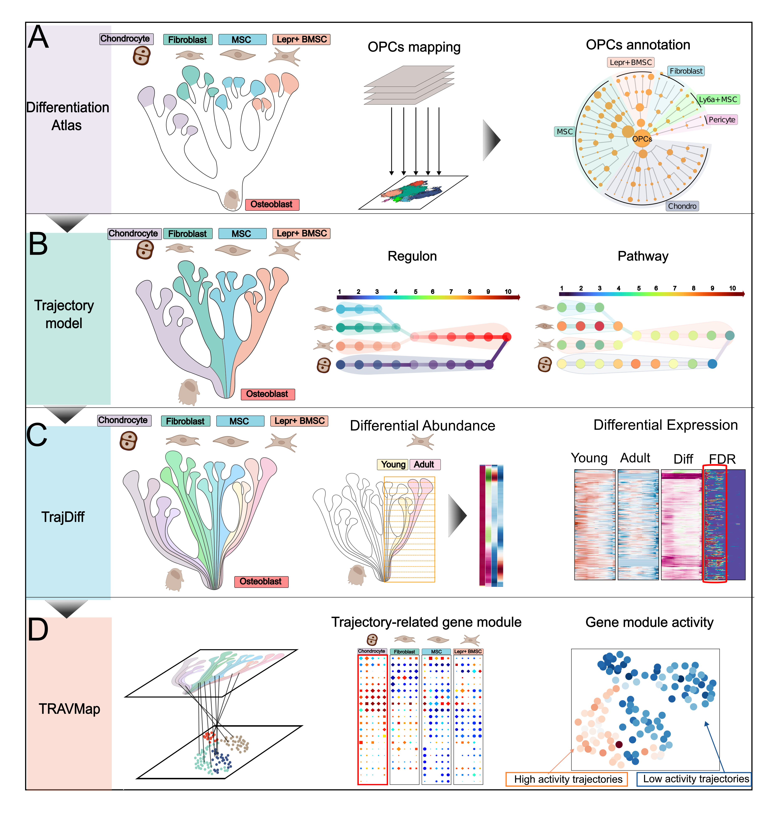

  

<h1>
Unraveling multi-scale differentiation heterogeneity with trajectory-centric framework
</h1>

TrajAtlas is a trajectory-centric framework designed to uncover heterogeneity among cells, genes, and gene modules across large-scale trajectories. It is applicable to, but not limited to, osteogenesis datasets. This repository contains the following modules:

- model: Enables users to project their datasets onto our `Differentiation Atlas` and predict lineage paths and pseudotime in the `OPCST model`.
- TrajDiff: Enable user to detect covariate-related differential cell abundance and genes along differentiation process across multiple trajectories.
- TRAVMap: enable user to detect pseudotemporal gene module and identified Trajectory-related Replicable Axes of Variation (TRAV)

  

## Getting started

Please refer to the [documentation](https://trajatlas.readthedocs.io/en/stable/). In particular:

- [API documentation](https://trajatlas.readthedocs.io/en/stable/api/index.html)
- [Tutorial](https://trajatlas.readthedocs.io/en/stable/tutorial/index.html)

## Installation

You need to have Python 3.8 or newer installed on your system. If you don't have Python installed, we recommend installing [Mamba](https://mamba.readthedocs.io/en/latest/installation/mamba-installation.html).
