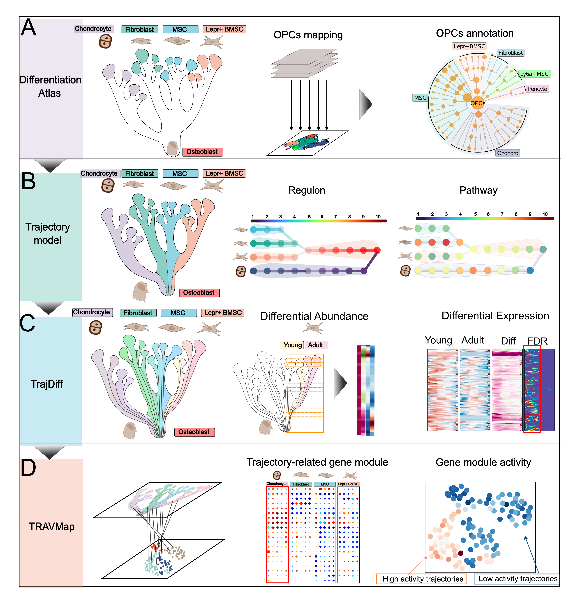

Welcome to TrajAtlas' documentation!
==============================================

**TrajAtlas** is a trajectory-centric framework for unnraveling multi-scale differentiation heterogeneity 
across population-level trajectories. With TrajAtlas, you are able to explore heterogeneity among cells, genes, and
gene modules across large-scale trajectories!

To grasp the foundational concepts of TrajAtlas, please refer to the detailed information provided in :doc:`about/index`.

.. note::

   This project is under active development.

TrajAtlas' Key Applications
---------------------------
- Differential pseudotime analysis, including:
   :doc:`Differential Abundance analysis <tutorial/Step2_differential_abundance>`

   :doc:`Differential Expression analysis <tutorial/step3_DE>`

- Detecting pseudotemporal gene module
   :doc:`Detecting pseudotemporal gene module <tutorial/pseudotemporal_gene_module>`

- Projecting osteogenesis datasets to Differential Atlas and OPCST model, including:
   :doc:`Projecting osteogenesis datasets <tutorial/1_OPCST_projecting>`

- … and much more, check out our :doc:`API <api/index>`

Getting Started with TrajAtlas
-----------------------------
We have :doc:`tutorial/index` to help you getting started. To see TrajAtlas in action, please explore our
manuscript.

Contributing
------------
We actively encourage any contribution! To get started, please check out the :doc:`contributing`.

.. toctree::
   :caption: General
   :maxdepth: 3
   :hidden:

   installation
   tutorial/index
   api/index
   release_notes
   contributing
   references

.. toctree::
   :caption: About
   :maxdepth: 3
   :hidden:

   about/index
   about/team
   GitHub <https://github.com/GilbertHan1011/TrajAtlas>

