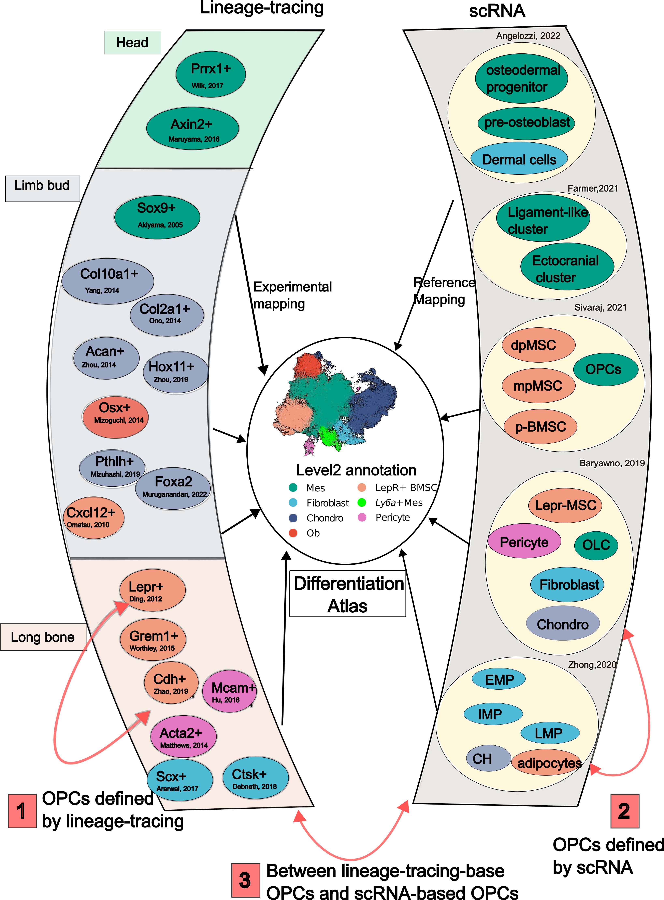
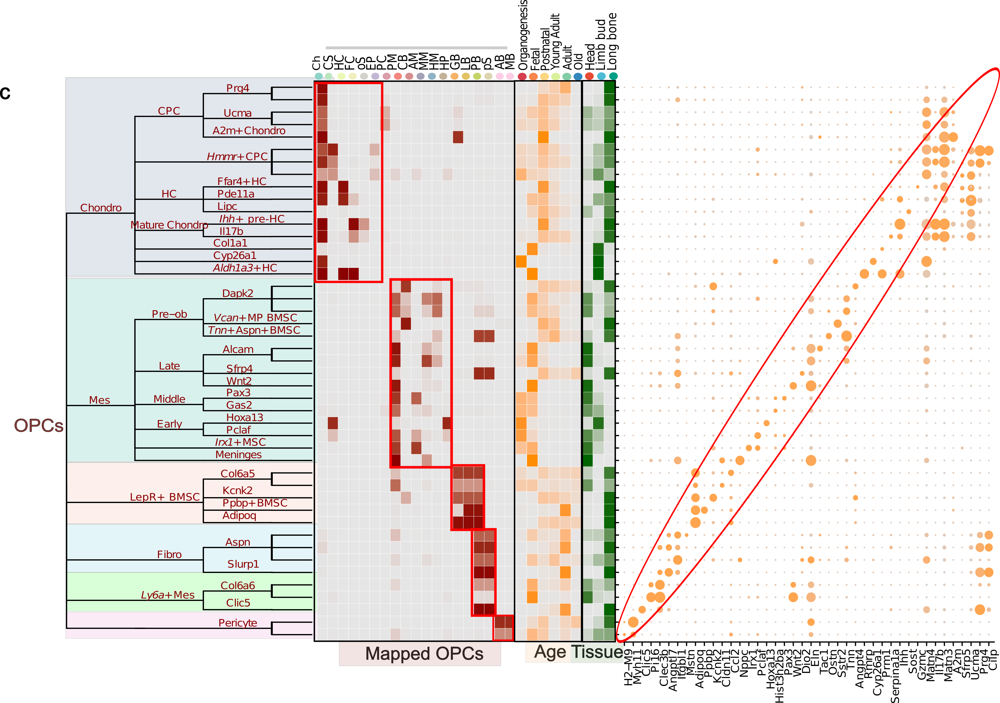

# Differentiation Atlas

## What is Differentiation Atlas
**Differentiation Atlas** is a reference atlas specifically focused on osteoblast differentiation. It includes data from 110 samples and 272,369 cells. This atlas also incorporates experimentally validated osteoprogenitors to enhance bone research. It offers seven levels of annotation and can be easily projected onto your own datasets.

## Why Differentiation Atlas is necessary?

Osteoprogenitor cells are defined with two distinct approachs, scRNA and lineage-tracing {cite:p}`mizoguchiDiverseOriginBoneforming2021`, however, existing annotation system is often too crude.

1) Lineage-tracing-defined classification of OPCs is crude. The overlap between different lineage-tracing-defined OPCs is unclear. For example, it’s uncertain whether LepR+ BMSCs and Grem1+ BMSCs, both discovered in long bones but labeled with different markers, overlap. However, incorporating of these cells into our Differentiation Atlas shows many cells highly express both markers in long bones , suggesting significant overlap between these groups. We have presented these results on our website: [shiny_OPC](https://zyflab.shinyapps.io/TrajAtlas_shiny/.)

2) OPCs defined by scRNA is crude. As illustrated in the right panel of figure below, which summarizes annotations from various studies, there is notable variability in how OPCs are defined. For example, Sivaraj et al defined one BMSC population in long bone as dpMSC based on their spatial expression pattern {cite:p}`sivarajRegionalSpecializationFate2021` , Baryawno defined the similar population as Lepr-MSC based on cell markers in a unique cell population from scRNA dataset {cite:p}`baryawnoCellularTaxonomyBone2019`, and Zhong et al defined them as adipocytes based on their potential of adipogenesis {cite:p}`zhongSingleCellTranscriptomics2020`. However, in our Differentiation Atlas, we find cells with these characteristics are literally the same.  Such inconsistent annotations can lead to confusion. By label tranfering with TrajAtlas, we can easily solve this problem, without downloading and integrating with huge datasets. We show this process in the tutorial [OPCST_projecting](./../tutorial/1_OPCST_projecting.md).

3) The relationship between scRNA-based OPCs and lineage-tracing based OPCs is crude. It is crucial to integrate lineage-tracing-based OPCs into single-cell datasets to gain a more comprehensive understanding. However, the limited size of scRNA-seq datasets may obscure certain cellular states. With the Differentiation Atlas, which includes a reference atlas of 270,000 osteogenesis-related cells, we are able to uncover rare cell states that might be hidden in smaller scRNA-seq datasets.

## What is tree-based annotation system in TrajAtlas

Recently, Silvia Domcke et al. advocated for the adaptation of data-driven, tree-based nomenclature to build a reference cell tree {cite:p}`domckeReferenceCellTree2023`. Our seven-level annotation system is inspired by this approach. We recognize that cells cannot be classified solely by marker genes, as cell states are often dependent on time and spatial context. Therefore, we aim to describe cell types from multiple perspectives:

1. The consensus name of the cell type.

2. How previous studies have defined this cell type.

3. The age at which this cell type occurs in the organism.

4. The tissue locations where this cell type is typically found.

5. The genes that are typically highly expressed in this cell type.

To address this complexity, we created tree-based seven level annotation system, which defines cell types from these multiple aspects. The leftmost tree presents our annotation names based on consensus terminology, showcasing a five-level classification that transitions from coarse-grained to finer-grained nomenclature. The middle brown section represents osteoprogenitor cells as defined in other studies, which we have integrated into our reference atlas. The orange heatmap illustrates the likelihood of cell presence at various ages of the organism, while the green heatmap indicates the tissues where these cells are usually located. The right dot plot displays gene expression data. This comprehensive approach allows us to create a robust annotation system.

