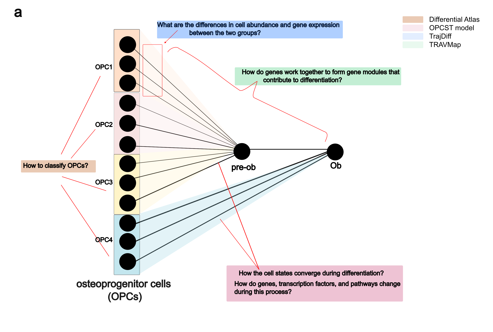
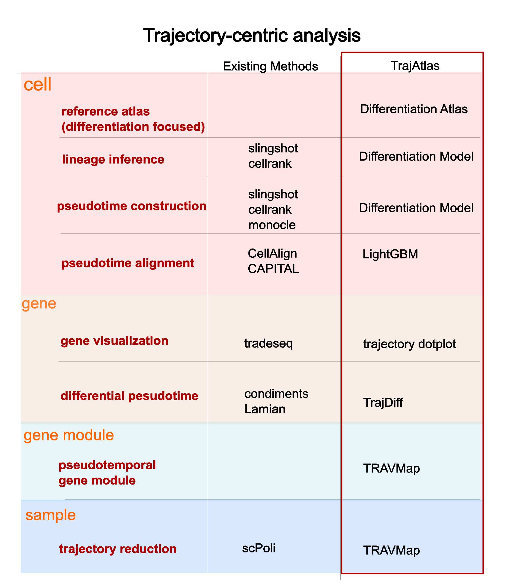

# Introduction to TrajAtlas

## What is TrajAtlas
TrajAtlas is a framework designed to investigate differentiation using single-cell RNA (scRNA) datasets. It provides a comprehensive approach to studying differentiation from multiple perspectives, allowing users to explore changes in cells, genes, and gene modules.

## How TrajAtlas can help us understand differentiation
Differentiation is a complex process involving numerous changes. TrajAtlas addresses key questions regarding these changes:

1. **What changes occur during differentiation?** Is it the gene expression, transcription factors, pathways, or gene modules that are affected?
    
2. **When do these changes happen?** Are they observed in the early, middle, or late stages of differentiation?
    
3. **How do covariates such as age and tissue type influence differentiation?** What is their relationship to the differentiation process?

To address these questions, TrajAtlas breaks down differentiation into three biological aspects: cells, genes, and gene modules. The framework includes four modules to tackle these challenges: the Differentiation Atlas, the OPCST model, TrajDiff, and TRAVMap.

## What's TrajAtlas different than other algorithm

Existing methods often focus on one or two specific aspects of differentiation. For example, Slingshot {cite:p}`streetSlingshotCellLineage2018` emphasizes the cellular perspective, detailing the order and fate of cells during differentiation, while tradeSeq {cite:p}`vandenbergeTrajectorybasedDifferentialExpression2020` focuses on changes in gene expression patterns over time.

Given the multifaceted nature of cell differentiation—which includes the classification of progenitor cells, and transcriptional regulation changes—an integrative approach is necessary for a comprehensive view. TrajAtlas offers an all-in-one framework for analyzing differentiation, combining these various aspects into a unified analysis.

## Basic thoughts behind TrajAtlas

This software is designed to dissect dynamic process in a comprehensive way. 
Instead of explore static perspective on cell type and gene expression, we propose a “trajectory-centric analysis” method
for understanding dynamic processes, such as differentiation, cell cycle.

We initially chose osteoblast differentiation as a template, considering that osteoblasts can differentiate from various 
osteoprogenitors across a wide range of tissues and ages {cite:p}`mizoguchiDiverseOriginBoneforming2021` {cite:p}`liInsightsSkeletalStem2022`. This diversity suggests significant heterogeneity within this process.

We integrated trajectories from 27 datasets to build **Differentiation Atlas**, to explore the heterogeneity of osteoprogenitor cells.
Then we reconstructed osteogensis differentiation with a OsteoProgenitor Cells-Specific trajectory (OPCST) Model. In this model, we inferred 
differentation path from four osteoprogenitors to osteoblast and a common pseudotime to predict differentiation process.
We implemented this functionality within the TrajAtlas.model, allowing users to apply it to their own datasets.

In multi-stage differentiation processes like osteoblast differentiation, it is crucial to accurately identify the stage at which 
differential genes exert their influence. However, existing methods like **Lamian** {cite:p}`houStatisticalFrameworkDifferential2023` 
and **Condiments** {cite:p}`rouxdebezieuxTrajectoryInferenceMultiple2024` often struggle to infer differential 
abundance and expression within specific differentiation stages. This gap motivated the development of TrajDiff, which aims to uncover 
changes in cell abundance and expression across differentiation stages.

While **TrajDiff** is capable of detecting differences among multiple trajectories, dissecting heterogeneity within population-level trajectories 
remains challenging. To address this, we developed **TRAVMap**. **TRAVMap** is designed to identify pseudotemporal gene modules among trajectories. 
Furthermore, to enhance our understanding of heterogeneity among trajectories, we employed trajectory representation learning 
using information from genes and gene modules. Through trajectory reduction techniques, we enable the visualization of gene module activity 
and gene expression across population-level trajectories.
