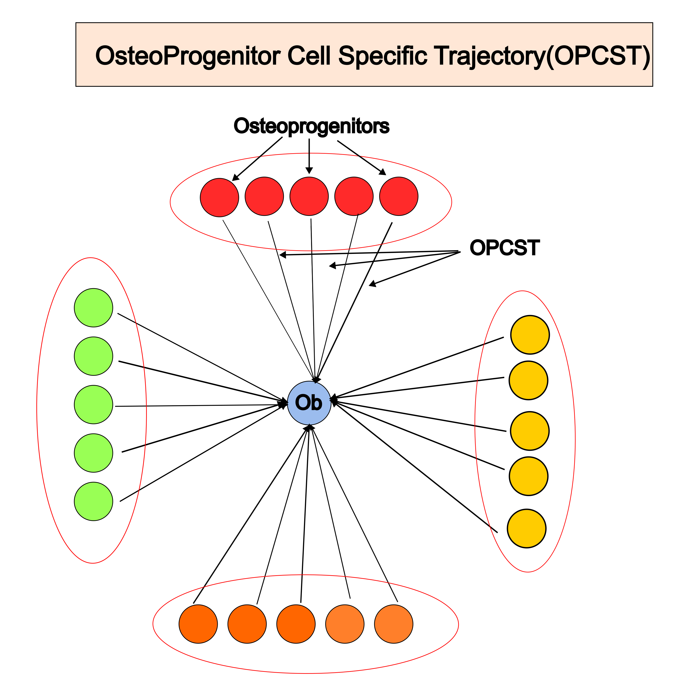
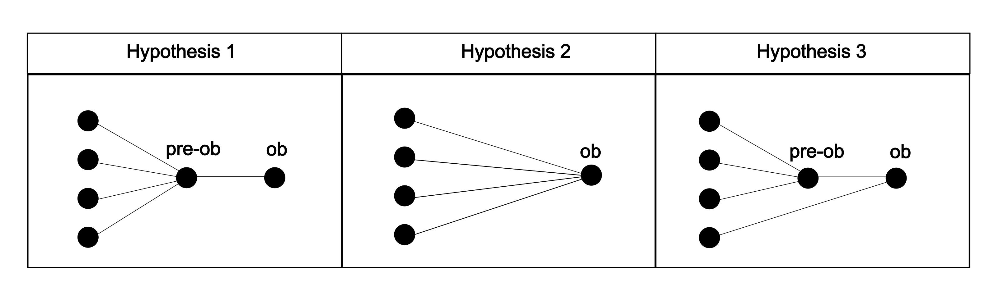

# OPCST model

## What is OPCST
In our Differentiation Atlas, we identified a variety of osteoprogenitors. To understand how these cells become osteoprogenitors, we observed that osteoprogenitors in similar states follow comparable differentiation trajectories. Based on this observation, we grouped trajectories from the same osteoprogenitor category into clusters, which we refer to as OsteoProgenitor Cell Specific Trajectories (OPCST).

## Why we need a new model of osteoblast differentiation

The concepts of intramembranous ossification and endochondral ossification have a history spanning over 300 years {cite:p}`yuanSkeletalStemCells2024`. In the early definitions, ossification occurring in connective tissues was referred to as intramembranous ossification, while ossification in cartilage tissue was known as endochondral ossification {cite:p}`tuttlePrinciplesHistologyDescriptive1898`. Although this classification has evolved significantly over time, it remains primarily a histological concept rather than one rooted in cellular biology. The distinction between the two ossification pathways is based on the presence of a cartilaginous template. This differentiation is useful, as it represents two distinct pathways in flat bones and long bones, and it also has evolutionary implications. However, many instances of ossification do not conform to these typical pathways. For example, Seoyeon et al. {cite:p}`bokMultistemCellBasis2023` found that in sutures, there is a distinct form of endochondral ossification that occurs without the typical hematopoietic marrow formation. Additionally, many tissues may combine both endochondral and intramembranous ossification during osteogenesis, such as the periosteum{cite:p}`debnathDiscoveryPeriostealStem2018` and limb buds{cite:p}`mizoguchiDiverseOriginBoneforming2021`. Furthermore, advancements in technologies like lineage tracing and single-cell RNA sequencing (scRNA-seq) reveal the diverse origins of osteoblasts, an aspect that cannot be captured by the histological paradigm. All these anomalies challenge the current paradigm, highlighting the need for a cellular-level paradigm to incorporate these advancements and account for the varied origins of osteoblasts. This is the motivation behind the OPCST model in our project.

## What is common peudotime in OPCST model

## How to interprete the merged trajectory

It's well-established that various osteoprogenitors can differentiate into osteoblasts. In our OPCST model, we have identified four distinct osteoprogenitor populations that ultimately differentiate into the same cell type. However, the process by which these progenitors converge into a uniform cell type remains unclear. For example, there are at least three distinct ways regarding this convergence. **Hypothesis 1**: All osteoprogenitors pass through common cellular states before ultimately differentiating into osteoblasts. **Hypothesis 2**: Osteoprogenitors transition directly into osteoblasts without a shared intermediate state. **Hypothesis 3**: Some osteoprogenitors converge into a pre-osteoblast state, while others directly become osteoblasts.

This problem is essential to understanding osteogenesis, however, due to a lack of algorithms and datasets, this question cannot be fully explored. Most algorithms focus on the lineage decision process, where one progenitor gives rise to multiple cell types. In contrast, our approach can be considered a reverse problem, known as lineage convergence {cite:p}`bandlerSinglecellDelineationLineage2022`. This concept has been explored in various contexts, including immune cells{cite:p}`alemanyWholeorganismCloneTracing2018a`, neural crest lineages{cite:p}`wagnerSinglecellMappingGene2018`, and endodermal populations{cite:p}`nowotschinEmergentLandscapeMouse2019`. Here, using a new algorithm and large-scale datasets, we are able to build a model based on the similarity of cell states. Our results indicate that the mesenchyme, fibroblast, and LepR+ BMSC lineages converge at the pre-osteoblast stage, whereas the chondrocyte lineage converges at the osteoblast stage (Hypothesis 3).
