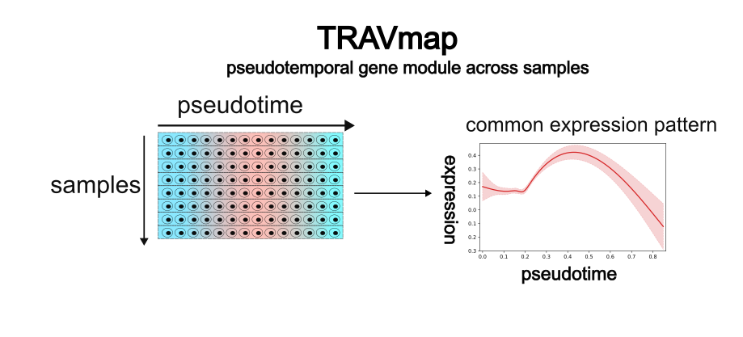

# TRAVMap
## What is TRAV
Gene module, and gene expression program are terms used to describe gene sets that are clustered de novo based on similar expression patterns. In our paper, we adapt the term "gene module," which is more frequently used in single-cell RNA sequencing (scRNA) studies {cite:p}`saelensComprehensiveEvaluationModule2018`. While TRAV (Trajectory-related Replicable Axes of Variation) is also clustered de novo based on expression patterns, it is not synonymous with gene modules. There are two main differences:1. Gene modules are typically detected from a single dataset, whereas TRAVs are derived from multiple samples. 2. TRAV focus more on differentiation. To emphasize this distinction, we reference the term "Replicable Axes of Variation" (RAV) from Sehyun et al. {cite:p}`ohGenomicSuperSignatureFacilitatesInterpretation2022`., which combines large-scale bulk RNA datasets to detect replicate axes. Our approach, Trajectory-related Replicable Axes of Variation (TRAV), builds upon this concept.

Current gene module detection methods, such as cNMF{cite:p}`debruineFastRobustNonnegative2021` and hdWGCNA{cite:p}`morabitoHdWGCNAIdentifiesCoexpression2023`, can’t integrate multiple datasets to yield more reliable results. However, gene modules observed in single datasets can be subject to biases. This limitation arises primarily because current gene module methods utilize individual cells as observation units, and cells typically cannot undergo repeated measures. To address this issue, we use differentiation as an axis that occurs across multiple samples. We then “project” the gene expression of all datasets onto this axis to identify gene programs that consistently recur. This approach allows us to uncover pseudotemporal gene modules that appear across multiple samples.

To use TRAV, please read [this tutorial](./../tutorial/pseudotemporal_gene_module.md)

