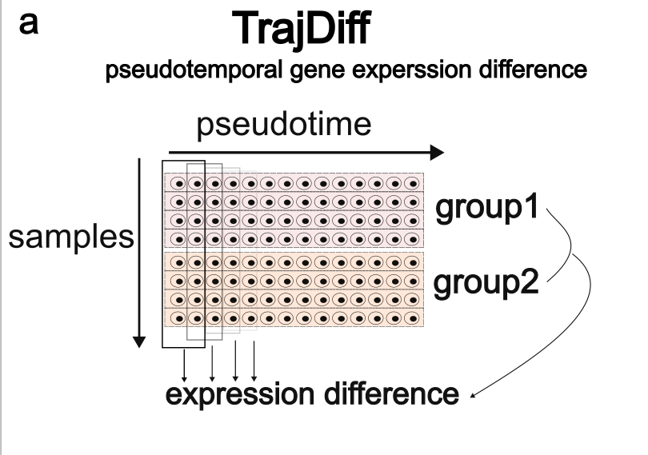
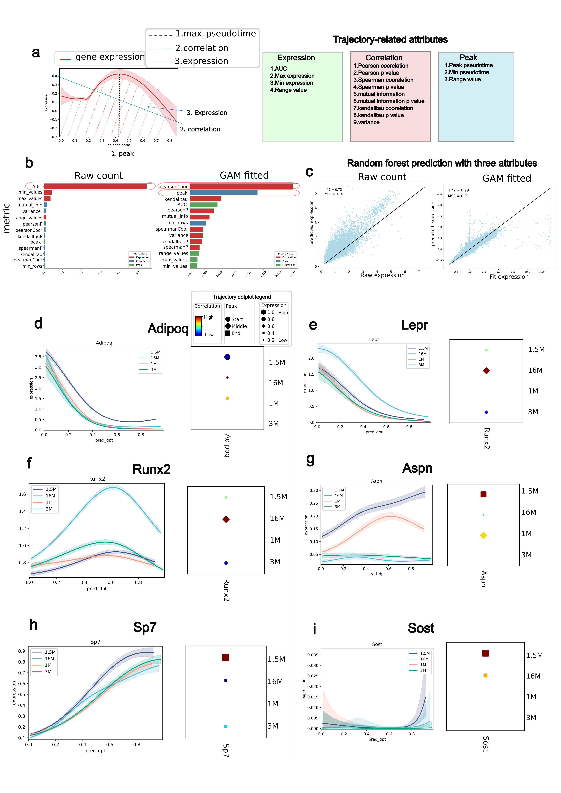

# TrajDiff

## What is TrajDiff

**TrajDiff** is an algorithm designed to identify local differences in cell abundance and gene expression throughout differentiation. It enables the detection of both persistent and transient expression differences between two groups as they progress through the differentiation process.

To try TrajDiff, please check this [DA tutorial](./../tutorial/Step2_differential_abundance.md) and [DE tutorial](./../tutorial/step3_DE.md).

## Visualize large scale trajectories with Trajectory dotplot

How to Visualize Gene Expression Across Large-Scale Trajectories?

To address this, we developed a new visualization method called the **trajectory dotplot**.

This method summarizes the relationship between gene expression and pseudotime using three attributes:

- **Gene Expression:** Represents the overall expression levels.
- **Gene Correlation:** Indicates the correlation between gene expression and pseudotime.
- **Gene Peak:** Represents the maximum expression level observed over pseudotime.

We have demonstrated that these three attributes effectively capture and recover the raw gene expression data.

In the trajectory dotplot:

- The **size** of each dot reflects the area under the curve, representing gene expression.
- The **color** of each dot indicates the Pearson correlation coefficient, showing the correlation between gene expression and pseudotime.
- The **shape** of each dot represents the pseudotime at which the maximum expression (peak) occurs.

