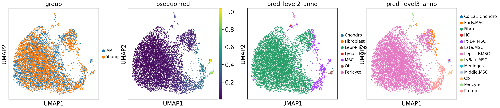
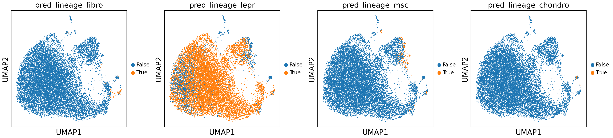
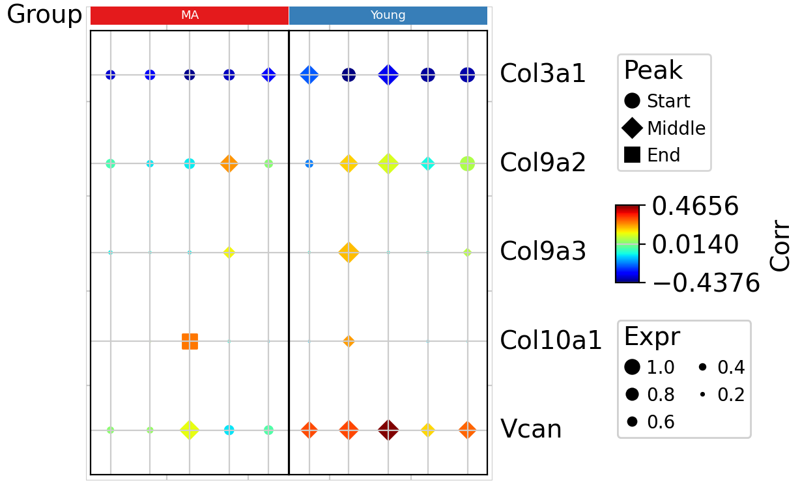

# Projecting Osteogenic Datasets onto Differentiation Atlas and OPCST Model Using TrajAtlas

We have recently developed a reference atlas for osteogenesis and constructed a model to reconstruct the transformation of various osteoprogenitor cells (OPCs) into osteoblasts. In this tutorial, we will demonstrate how to project osteogenic datasets onto our atlas and utilize our models for analysis.

## Import packages & data

We utilized datasets obtained from GSE210584 for our study. In this research conducted by Kira Young, the investigation focused on age-related changes in the bone marrow microenvironment between young mice (2-4 months old) and middle-aged mice (12-14 months old). This dataset provided valuable insights into the age-related alterations in osteogenesis within the bone marrow.

```python
import scanpy as sc
import pandas as pd
import TrajAtlas as tja
```

```python
adata=sc.read("../data/trajAtlas_age_young.h5ad")
```

Ensure that your datasets include a "sample" column to record sample information and a layer "counts" to store raw counts information.

```python
adata.layers["counts"][0:5,0:5].toarray()
```

    array([[0., 0., 0., 0., 0.],
           [0., 0., 0., 0., 0.],
           [0., 0., 0., 0., 0.],
           [0., 0., 0., 0., 3.],
           [0., 0., 0., 0., 1.]])

```python
adata.obs[['group', 'sample']]
```


|                   | group | sample               |
|-------------------|-------|----------------------|
| AAACCCATCCAATCCC-1_1 | MA    | BmscAging_Young_MA1 |
| AAACCCATCTCAGTCC-1_1 | MA    | BmscAging_Young_MA1 |
| AAACGCTAGTATGACA-1_1 | MA    | BmscAging_Young_MA1 |
| AAACGCTGTACGAGCA-1_1 | MA    | BmscAging_Young_MA1 |
| AAAGAACCAACCCTCT-1_1 | MA    | BmscAging_Young_MA1 |
| ...               | ...   | ...                  |
| TTTGATCAGAGCTTTC-1_14 | Young | BmscAging_Young_Young5 |
| TTTGATCGTAAGAACT-1_14 | Young | BmscAging_Young_Young5 |
| TTTGATCTCACCTGTC-1_14 | Young | BmscAging_Young_Young5 |
| TTTGGTTTCTCTCCGA-1_14 | Young | BmscAging_Young_Young5 |
| TTTGTTGAGGCCACCT-1_14 | Young | BmscAging_Young_Young5 |

## Projection

We utilized [scArches](https://docs.scarches.org/en/latest/index.html) to project datasets to our Differentiation Atlas.

```python
adata=tja.model.ProjectData(adata)
```

    Total number of genes needed for mapping: 1500
    Number of genes found in query dataset: 1446

    `Trainer.fit` stopped: `max_epochs=100` reached.

    Epoch 100/100: 100%|██████████| 100/100 [04:03<00:00,  2.43s/it, loss=719, v_num=1]

```python
sc.pp.neighbors(adata,use_rep="scANVI")
sc.tl.umap(adata)
```

In our study, we developed an OsteoProgenitor Cell-Specific Trajectory (OPCST) Model to reconstruct the osteoblast differentiation process.Our common pseudotime accurately reflects the osteogenesis process. Additionally, we constructed a regression model to predict the common pseudotime across different OPCSTs, enabling users to easily predict osteogenesis progression.

```python
adata=tja.model.pseduo_predict(adata)
```

    Total number of genes needed for mapping: 2146
    Number of genes found in query dataset: 2070

    /home/gilberthan/anaconda3/envs/scarches/lib/python3.8/site-packages/anndata/_core/merge.py:1111: UserWarning: Only some AnnData objects have`.raw` attribute, not concatenating `.raw` attributes.
      warn(

We used knn model for transform seven-level annotation system and OPCST path to datasets.

```python
adata=tja.model.label_transfer(adata)
```

    finished!

```python
adata
```

    AnnData object with n_obs × n_vars = 15079 × 22076
        obs: 'orig.ident', 'nCount_RNA', 'nFeature_RNA', 'percent_mito', 'RNA_snn_res.0.5', 'seurat_clusters', 'group', 'sample', 'pseduoPred', 'pred_level1_anno', 'pred_level2_anno', 'pred_level3_anno', 'pred_level4_anno', 'pred_level5_anno', 'pred_level6_anno', 'pred_level7_anno', 'pred_lineage_fibro', 'pred_lineage_lepr', 'pred_lineage_msc', 'pred_lineage_chondro'
        var: 'vst.mean', 'vst.variance', 'vst.variance.expected', 'vst.variance.standardized', 'vst.variable'
        uns: 'neighbors', 'umap'
        obsm: 'scANVI', 'X_umap'
        layers: 'counts'
        obsp: 'distances', 'connectivities'

```python
sc.pl.umap(adata,color=["group","pseduoPred","pred_level2_anno","pred_level3_anno"])
```

    /home/gilberthan/anaconda3/envs/scarches/lib/python3.8/site-packages/scanpy/plotting/_tools/scatterplots.py:392: UserWarning: No data for colormapping provided via 'c'. Parameters 'cmap' will be ignored
      cax = scatter(
    /home/gilberthan/anaconda3/envs/scarches/lib/python3.8/site-packages/scanpy/plotting/_tools/scatterplots.py:392: UserWarning: No data for colormapping provided via 'c'. Parameters 'cmap' will be ignored
      cax = scatter(
    /home/gilberthan/anaconda3/envs/scarches/lib/python3.8/site-packages/scanpy/plotting/_tools/scatterplots.py:392: UserWarning: No data for colormapping provided via 'c'. Parameters 'cmap' will be ignored
      cax = scatter(



```python
sc.pl.umap(adata,color=['pred_lineage_fibro', 'pred_lineage_lepr', 'pred_lineage_msc', 'pred_lineage_chondro'])
```

    /home/gilberthan/anaconda3/envs/scarches/lib/python3.8/site-packages/scanpy/plotting/_tools/scatterplots.py:392: UserWarning: No data for colormapping provided via 'c'. Parameters 'cmap' will be ignored
      cax = scatter(
    /home/gilberthan/anaconda3/envs/scarches/lib/python3.8/site-packages/scanpy/plotting/_tools/scatterplots.py:392: UserWarning: No data for colormapping provided via 'c'. Parameters 'cmap' will be ignored
      cax = scatter(
    /home/gilberthan/anaconda3/envs/scarches/lib/python3.8/site-packages/scanpy/plotting/_tools/scatterplots.py:392: UserWarning: No data for colormapping provided via 'c'. Parameters 'cmap' will be ignored
      cax = scatter(
    /home/gilberthan/anaconda3/envs/scarches/lib/python3.8/site-packages/scanpy/plotting/_tools/scatterplots.py:392: UserWarning: No data for colormapping provided via 'c'. Parameters 'cmap' will be ignored
      cax = scatter(



From the figure above, it is evident that our datasets primarily consist of LepR+ BMSC OPCST. As our focus lies solely on the osteogenesis process, we subtracted the LepR+ BMSC lineage from these datasets.

```python
adata=tja.model.substractLineageAdata(adata,["LepR_BMSC"])
```

## Visualize pseudotemporal gene expression patterns across multiple trajectories.

In our study, we extracted three characteristics from the pseudotemporal gene expression pattern: peak, correlation, and expression. We have demonstrated that these three characteristics can effectively reconstruct gene expression patterns. Utilizing these characteristics offers a method to visualize gene expression patterns across multiple trajectories.

```python
lineageCell = adata.obs_names[adata.obs["pred_lineage_lepr"]]
tvMap=tja.utils.getAttributeBase(adata,axis_key="pseduoPred", sampleKey="sample",subsetCell=lineageCell,njob=10)
```

    0%|          | 0/10 [00:00<?, ?it/s]
    100%|██████████| 10/10 [00:00<00:00, 12.43it/s]

```python
tvMap
```

<pre>MuData object with n_obs × n_vars = 10 × 66228
  3 modalities
    corr:	10 x 22076
      layers:	'mod'
    expr:	10 x 22076
      layers:	'mod'
    peak:	10 x 22076
      layers:	'mod'</pre>

We devised a [muon](https://muon.scverse.org/) object to store these expression characteristics, comprising three modalities: corr (correlation), peak, and expr (expression), each representing a distinct aspect of the data.

```python
groupObs=adata.obs[["sample","group"]].drop_duplicates()
```

```python
groupObs.index=tvMap.obs_names
```

```python
groupObs
```

<table border="1" class="dataframe">
  <thead>
    <tr style="text-align: right;">
      <th></th>
      <th>sample</th>
      <th>group</th>
    </tr>
  </thead>
  <tbody>
    <tr>
      <th>BmscAging_Young_MA1_sep_LepR_BMSC</th>
      <td>BmscAging_Young_MA1</td>
      <td>MA</td>
    </tr>
    <tr>
      <th>BmscAging_Young_MA2_sep_LepR_BMSC</th>
      <td>BmscAging_Young_MA2</td>
      <td>MA</td>
    </tr>
    <tr>
      <th>BmscAging_Young_MA3_sep_LepR_BMSC</th>
      <td>BmscAging_Young_MA3</td>
      <td>MA</td>
    </tr>
    <tr>
      <th>BmscAging_Young_MA4_sep_LepR_BMSC</th>
      <td>BmscAging_Young_MA4</td>
      <td>MA</td>
    </tr>
    <tr>
      <th>BmscAging_Young_MA5_sep_LepR_BMSC</th>
      <td>BmscAging_Young_MA5</td>
      <td>MA</td>
    </tr>
    <tr>
      <th>BmscAging_Young_Young1_sep_LepR_BMSC</th>
      <td>BmscAging_Young_Young1</td>
      <td>Young</td>
    </tr>
    <tr>
      <th>BmscAging_Young_Young2_sep_LepR_BMSC</th>
      <td>BmscAging_Young_Young2</td>
      <td>Young</td>
    </tr>
    <tr>
      <th>BmscAging_Young_Young3_sep_LepR_BMSC</th>
      <td>BmscAging_Young_Young3</td>
      <td>Young</td>
    </tr>
    <tr>
      <th>BmscAging_Young_Young4_sep_LepR_BMSC</th>
      <td>BmscAging_Young_Young4</td>
      <td>Young</td>
    </tr>
    <tr>
      <th>BmscAging_Young_Young5_sep_LepR_BMSC</th>
      <td>BmscAging_Young_Young5</td>
      <td>Young</td>
    </tr>
  </tbody>
</table>


We employed PyComplexHeatmap to generate a dot plot, allowing the selection of genes and samples for visualization. Specifically, we chose genes associated with Extracellular Matrix Organization. Our study revealed that these genes exhibit upregulation during the entire differentiation process in the young age of LepR+ BMSCs.

```python
dotDf=tja.utils.makeDotTable(tvMap,gene=["Col3a1","Vcan","Col10a1","Col9a3","Col9a2"],
                             sample=tvMap.obs_names)
```

```python
import PyComplexHeatmap as pch
col_ha = pch.HeatmapAnnotation(Group=pch.anno_simple(groupObs['group'],cmap='Set1',legend=False,add_text=True),
                           verbose=0,label_side='left',label_kws={'horizontalalignment':'right'})

```

```python
tja.utils.trajDotplot(dotDf,col_split=groupObs['group'],top_annotation=col_ha)
```

    Starting plotting..
    Starting calculating row orders..
    Reordering rows..
    Starting calculating col orders..
    Reordering cols..
    Plotting matrix..
    Collecting legends..
    Plotting legends..
    Estimated legend width: 12.172222222222222 mm
    Incresing ncol



This result is highly consistent with our research findings. We observed a distinct expression pattern between these two groups.
