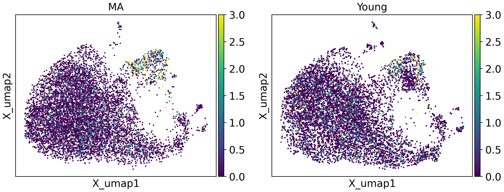

# TrajAtlas Meets Gene Expression Patterns

Wait... What if I don't intersted in trajectory? Can I use TrajAtlas?

Of course!

TrajAtlas originally base on pseudotime -- an axis to perform downstream analysis. Actually, here are a lot of meaningful axises, such as gene expression pattern, cell cycle... 

Here, we show how you can conbine GEP with TrajAtlas.


```python
import TrajAtlas as tja
import scanpy as sc
from cnmf import cNMF
import numpy as np
import pandas as pd
```

## cNMF pipeline

Firstly, we use [cNMF](https://github.com/dylkot/cNMF) to find gene expression patterns.


```python
numiter=20 ## Set this to a larger value for real data. We set this to a low value here for illustration
numworkers=1 ## Set this to a larger value and use the parallel code cells to try out parallelization
numhvgenes=1500 ## Number of over-dispersed genes to use for running the factorizations
K = np.arange(5,10)

## Results will be saved to [output_directory]/[run_name] which in this example is simulated_example_data/example_cNMF
output_directory = '../process/'
run_name = 'GEP'

countfn = '../data/4.15count.h5ad'
seed = 14
```


```python
adata = sc.read("../data/3.19_adata_immediate_step1.h5ad")
```


```python
adata.X = adata.layers["counts"]
```


```python
adata.write_h5ad("../data/4.15count.h5ad")
```


```python
cnmf_obj = cNMF(output_dir=output_directory, name=run_name)
```


```python
cnmf_obj.prepare(counts_fn=countfn, components=K, n_iter=numiter, seed=seed, num_highvar_genes=numhvgenes)
```

    /home/gilberthan/anaconda3/envs/scarches/lib/python3.8/site-packages/scanpy/preprocessing/_simple.py:843: UserWarning: Received a view of an AnnData. Making a copy.
      view_to_actual(adata)


```python
cnmf_obj.factorize()
```

    [Worker 0]. Starting task 0.
    [Worker 0]. Starting task 1.
    [Worker 0]. Starting task 2.
    [Worker 0]. Starting task 3.
    [Worker 0]. Starting task 4.
    [Worker 0]. Starting task 5.
    [Worker 0]. Starting task 6.
    [Worker 0]. Starting task 7.
    [Worker 0]. Starting task 8.
    [Worker 0]. Starting task 9.
    [Worker 0]. Starting task 10.
    [Worker 0]. Starting task 11.
    [Worker 0]. Starting task 12.
    [Worker 0]. Starting task 13.
    [Worker 0]. Starting task 14.
    [Worker 0]. Starting task 15.
    [Worker 0]. Starting task 16.
    [Worker 0]. Starting task 17.
    [Worker 0]. Starting task 18.
    [Worker 0]. Starting task 19.
    [Worker 0]. Starting task 20.
    [Worker 0]. Starting task 21.
    [Worker 0]. Starting task 22.
    [Worker 0]. Starting task 23.
    [Worker 0]. Starting task 24.
    [Worker 0]. Starting task 25.
    [Worker 0]. Starting task 26.
    [Worker 0]. Starting task 27.
    [Worker 0]. Starting task 28.
    [Worker 0]. Starting task 29.
    [Worker 0]. Starting task 30.
    [Worker 0]. Starting task 31.
    [Worker 0]. Starting task 32.
    [Worker 0]. Starting task 33.
    [Worker 0]. Starting task 34.
    [Worker 0]. Starting task 35.
    [Worker 0]. Starting task 36.
    [Worker 0]. Starting task 37.
    [Worker 0]. Starting task 38.
    [Worker 0]. Starting task 39.
    [Worker 0]. Starting task 40.
    [Worker 0]. Starting task 41.
    [Worker 0]. Starting task 42.
    [Worker 0]. Starting task 43.
    [Worker 0]. Starting task 44.
    [Worker 0]. Starting task 45.
    [Worker 0]. Starting task 46.
    [Worker 0]. Starting task 47.
    [Worker 0]. Starting task 48.
    [Worker 0]. Starting task 49.
    [Worker 0]. Starting task 50.
    [Worker 0]. Starting task 51.
    [Worker 0]. Starting task 52.
    [Worker 0]. Starting task 53.
    [Worker 0]. Starting task 54.
    [Worker 0]. Starting task 55.
    [Worker 0]. Starting task 56.
    [Worker 0]. Starting task 57.
    [Worker 0]. Starting task 58.
    [Worker 0]. Starting task 59.
    [Worker 0]. Starting task 60.
    [Worker 0]. Starting task 61.
    [Worker 0]. Starting task 62.
    [Worker 0]. Starting task 63.
    [Worker 0]. Starting task 64.
    [Worker 0]. Starting task 65.
    [Worker 0]. Starting task 66.
    [Worker 0]. Starting task 67.
    [Worker 0]. Starting task 68.
    [Worker 0]. Starting task 69.
    [Worker 0]. Starting task 70.
    [Worker 0]. Starting task 71.
    [Worker 0]. Starting task 72.
    [Worker 0]. Starting task 73.
    [Worker 0]. Starting task 74.
    [Worker 0]. Starting task 75.
    [Worker 0]. Starting task 76.
    [Worker 0]. Starting task 77.
    [Worker 0]. Starting task 78.
    [Worker 0]. Starting task 79.
    [Worker 0]. Starting task 80.
    [Worker 0]. Starting task 81.
    [Worker 0]. Starting task 82.
    [Worker 0]. Starting task 83.
    [Worker 0]. Starting task 84.
    [Worker 0]. Starting task 85.
    [Worker 0]. Starting task 86.
    [Worker 0]. Starting task 87.
    [Worker 0]. Starting task 88.
    [Worker 0]. Starting task 89.
    [Worker 0]. Starting task 90.
    [Worker 0]. Starting task 91.
    [Worker 0]. Starting task 92.
    [Worker 0]. Starting task 93.
    [Worker 0]. Starting task 94.
    [Worker 0]. Starting task 95.
    [Worker 0]. Starting task 96.
    [Worker 0]. Starting task 97.
    [Worker 0]. Starting task 98.
    [Worker 0]. Starting task 99.


```python
cnmf_obj.combine(skip_missing_files=True)
```

    Combining factorizations for k=5.
    Combining factorizations for k=6.
    Combining factorizations for k=7.
    Combining factorizations for k=8.
    Combining factorizations for k=9.


```python
cnmf_obj.k_selection_plot()
```


    

    


```python
selected_K = 6
## Setting density_threshold to 2.0 avoids any filtering
cnmf_obj.consensus(k=selected_K, density_threshold=2.0, show_clustering=True)
```

    /home/gilberthan/anaconda3/envs/scarches/lib/python3.8/site-packages/cnmf/cnmf.py:835: RuntimeWarning: invalid value encountered in divide
      norm_tpm = (np.array(tpm.X.todense()) - tpm_stats['__mean'].values) / tpm_stats['__std'].values
    /home/gilberthan/anaconda3/envs/scarches/lib/python3.8/site-packages/scanpy/preprocessing/_simple.py:843: UserWarning: Received a view of an AnnData. Making a copy.
      view_to_actual(adata)


    

    


```python
cnmf_obj.consensus(k=selected_K, density_threshold=0.1, show_clustering=True)
```

    /home/gilberthan/anaconda3/envs/scarches/lib/python3.8/site-packages/cnmf/cnmf.py:835: RuntimeWarning: invalid value encountered in divide
      norm_tpm = (np.array(tpm.X.todense()) - tpm_stats['__mean'].values) / tpm_stats['__std'].values
    /home/gilberthan/anaconda3/envs/scarches/lib/python3.8/site-packages/scanpy/preprocessing/_simple.py:843: UserWarning: Received a view of an AnnData. Making a copy.
      view_to_actual(adata)


    

    


```python
usage_matrix_file = cnmf_obj.paths['consensus_usages__txt'] % (selected_K, '0_1')
gene_scores_file = cnmf_obj.paths['gene_spectra_score__txt'] % (selected_K, '0_1')
usage=pd.read_table(usage_matrix_file,index_col=0)
genescore=pd.read_table(gene_scores_file,index_col=0)
```


```python
usage.columns = "pattern" + usage.columns.astype("str")
adata.obs[usage.columns] = usage
sc.pl.umap(adata,color=usage.columns)
```


    

    


After glancing at the gene expression patterns identified by cNMF, we observed that pattern1, pattern2, and pattern3 are meaningful. We extracted these patterns to perform downstream analysis.


```python
#genescore=genescore.T
genescore = genescore.dropna()
genescore.columns = usage.columns
max_column = np.argmax(genescore.values, axis=1)
genePatternIndex = genescore.columns[max_column]
adata.var["pattern"]=np.nan
adata.var["pattern"].loc[genescore.index] =genePatternIndex
```


## TrajAtlas analysis

We extracted correlation,expression, peak from the data, base on the three gene expression pattern as axis.


```python
tvMap = tja.utils.getAttributeGEP(adata,featureKey = "pattern",
                                  sampleKey = "sample",patternKey=["pattern1","pattern2","patern3"],njobs = 6)
```

    100%|██████████| 6/6 [00:00<00:00, 13.03it/s]
    2024-04-15 17:20:59.195690: W tensorflow/compiler/
    100%|██████████| 6/6 [00:00<00:00, 2309.64it/s]
    100%|██████████| 6/6 [00:00<00:00, 3335.87it/s]
    100%|██████████| 6/6 [00:00<00:00, 2251.37it/s]
    100%|██████████| 6/6 [00:00<00:00, 2532.79it/s]
    100%|██████████| 6/6 [00:00<00:00, 3550.98it/s]
    100%|██████████| 6/6 [00:00<00:00, 3948.82it/s]
    100%|██████████| 6/6 [00:00<00:00, 3699.22it/s]
    100%|██████████| 6/6 [00:00<00:00, 4534.38it/s]
    100%|██████████| 6/6 [00:00<00:00, 3152.82it/s]
    100%|██████████| 6/6 [00:00<00:00, 4255.30it/s]


We are interested in genes that exhibit varying expression patterns across different ages. Therefore, we extract a correlation model to investigate these differences further.


```python
tvMap["corr"].X = tvMap["corr"].layers["mod"]
```


```python
design =  adata.obs[["sample","group"]].drop_duplicates()
group1Name =design["sample"][design['group']=="Young"]
group2Name =design["sample"][design['group']=="MA"]
design=design.set_index("sample")
tvMap.obs["group"]=design.loc[tvMap.obs_names]
groupObs = tvMap.obs
```

We conduct a t-test on all genes, followed by filtering out genes with low expression levels to mitigate bias in our analysis. Subsequently, we select the 20 genes with the most significant changes for visualization.


```python
statics = tja.utils.attrTTest(tvMap["corr"],group1Name=group1Name,group2Name=group2Name)
```


```python
filterGene = tvMap["expr"].var_names[exprDf.mean()>0.5]
```


```python
selectGenes = statics[statics['P-value'] < 0.05][statics['Gene'].isin(filterGene)].sort_values(by='logFC')[0:20]["Gene"]
```


```python
exprDf = pd.DataFrame(tvMap["expr"].layers["mod"])
selectGenes2 = exprDf
```


```python
dotDf=tja.utils.makeDotTable(tvMap,gene=selectGenes,
                             sample=tvMap.obs_names)
```


```python
import PyComplexHeatmap as pch
col_ha = pch.HeatmapAnnotation(Group=pch.anno_simple(groupObs['group'],cmap='Set1',legend=False,add_text=True),
                           verbose=0,label_side='left',label_kws={'horizontalalignment':'right'})
```


```python
tja.utils.trajDotplot(dotDf,col_split=groupObs['group'],top_annotation=col_ha)
```

    Starting plotting..
    Starting calculating row orders..
    Reordering rows..
    Starting calculating col orders..
    Reordering cols..
    Plotting matrix..
    Collecting legends..
    Plotting legends..
    Estimated legend width: 14.813822222222225 mm
    Incresing ncol
    Incresing ncol
    More than 3 cols is not supported
    Legend too long, generating a new column..


    

    


```python
tja.utils.split_umap(adata,split_by = "group",basis="X_umap",color = ["Stxbp4"],vmax=3)
```


    

    


```python
tja.utils.split_umap(adata,split_by = "group",basis="X_umap",color = ["Cdkn2d"],vmax=5)
```


    

    


With dotplot and UMAP visualization, we can confirm that these gene expression programs have indeed changed.
