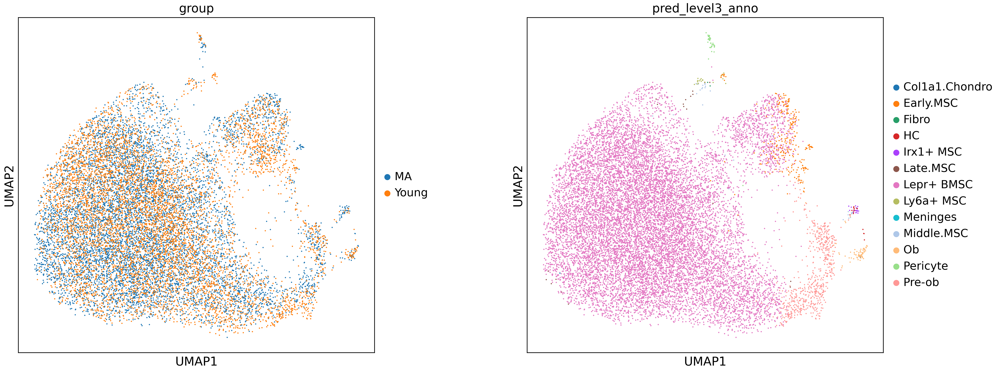
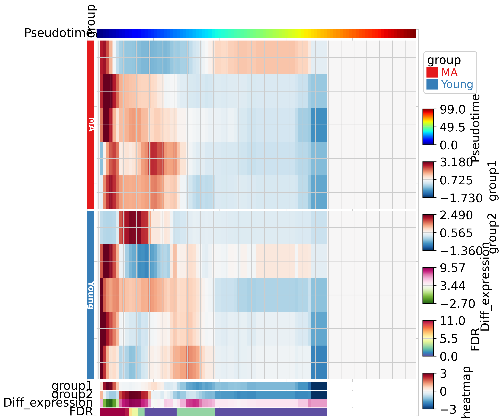

# Differential Abundance with TrajAtlas

## Setup


```python
import numpy as np
import scanpy as sc
import pandas as pd
import TrajAtlas as tja
sc.settings.verbosity = 3
import matplotlib.pyplot as plt
plt.rcParams["figure.figsize"] = (7, 7)
```
## About

To learn about TrajDiff, please read [TrajDiff](../introduction/TrajDiff.md)

## Datasets

In this tutorial, we continue with the adata we created in OPCST projecting.


```python
adata=sc.read("../data/3.19_adata_immediate_step1.h5ad")
```


```python
adata
```


    AnnData object with n_obs × n_vars = 15079 × 22076
        obs: 'orig.ident', 'nCount_RNA', 'nFeature_RNA', 'percent_mito', 'RNA_snn_res.0.5', 'seurat_clusters', 'group', 'sample', 'pseduoPred', 'pred_level1_anno', 'pred_level2_anno', 'pred_level3_anno', 'pred_level4_anno', 'pred_level5_anno', 'pred_level6_anno', 'pred_level7_anno', 'pred_lineage_fibro', 'pred_lineage_lepr', 'pred_lineage_msc', 'pred_lineage_chondro', 'lineageSum', 'Cell'
        var: 'vst.mean', 'vst.variance', 'vst.variance.expected', 'vst.variance.standardized', 'vst.variable'
        uns: 'group_colors', 'neighbors', 'pred_level2_anno_colors', 'pred_level3_anno_colors', 'pred_lineage_chondro_colors', 'pred_lineage_fibro_colors', 'pred_lineage_lepr_colors', 'pred_lineage_msc_colors', 'umap'
        obsm: 'X_umap', 'scANVI'
        layers: 'counts'
        obsp: 'connectivities', 'distances'


```python
sc.pl.umap(adata, color=["group","pred_level3_anno"], wspace=0.3, size=8)
```

    /home/gilberthan/anaconda3/envs/scarches/lib/python3.8/site-packages/scanpy/plotting/_tools/scatterplots.py:392: UserWarning: No data for colormapping provided via 'c'. Parameters 'cmap' will be ignored
      cax = scatter(
    /home/gilberthan/anaconda3/envs/scarches/lib/python3.8/site-packages/scanpy/plotting/_tools/scatterplots.py:392: UserWarning: No data for colormapping provided via 'c'. Parameters 'cmap' will be ignored
      cax = scatter(


    

    


```python
adata.obs[["sample","group"]].drop_duplicates()
```


<table border="1" class="dataframe">
  <thead>
    <tr style="text-align: right;">
      <th></th>
      <th>sample</th>
      <th>group</th>
    </tr>
  </thead>
  <tbody>
    <tr>
      <th>AAACCCATCCAATCCC-1_1</th>
      <td>BmscAging_Young_MA1</td>
      <td>MA</td>
    </tr>
    <tr>
      <th>AAACCCAAGCTAAACA-1_2</th>
      <td>BmscAging_Young_MA2</td>
      <td>MA</td>
    </tr>
    <tr>
      <th>AAACCCAGTAACATAG-1_3</th>
      <td>BmscAging_Young_MA3</td>
      <td>MA</td>
    </tr>
    <tr>
      <th>AAACCCACAGCGTACC-1_4</th>
      <td>BmscAging_Young_MA4</td>
      <td>MA</td>
    </tr>
    <tr>
      <th>AAACCCACAAAGGATT-1_5</th>
      <td>BmscAging_Young_MA5</td>
      <td>MA</td>
    </tr>
    <tr>
      <th>AAACCCAAGCGTTAGG-1_10</th>
      <td>BmscAging_Young_Young1</td>
      <td>Young</td>
    </tr>
    <tr>
      <th>AAACCCAGTTAAGAAC-1_11</th>
      <td>BmscAging_Young_Young2</td>
      <td>Young</td>
    </tr>
    <tr>
      <th>AAACGAAGTACCATAC-1_12</th>
      <td>BmscAging_Young_Young3</td>
      <td>Young</td>
    </tr>
    <tr>
      <th>AAACCCACACGAAAGC-1_13</th>
      <td>BmscAging_Young_Young4</td>
      <td>Young</td>
    </tr>
    <tr>
      <th>AAACGAACACCTCGTT-1_14</th>
      <td>BmscAging_Young_Young5</td>
      <td>Young</td>
    </tr>
  </tbody>
</table>


```python
tdiff=tja.diff.Tdiff()
```

## Building KNN graph (standard milo pipeline)
We followed the standard milo pipeline. The n_neighbors parameter represents the smallest possible size of the neighborhood in which we will quantify differential abundance (i.e., with k=50, the smallest neighborhood will have 50 cells). The value of k should increase with the sample count.


```python
sc.pp.neighbors(tdata['rna'], use_rep='scANVI', n_neighbors=200, n_pcs=15)
tdiff.make_nhoods(tdata['rna'], prop=0.08)
tdata =  tdiff.count_nhoods(tdata, sample_col="sample")
```

    computing neighbors
        finished: added to `.uns['neighbors']`
        `.obsp['distances']`, distances for each pair of neighbors
        `.obsp['connectivities']`, weighted adjacency matrix (0:00:38)


    /home/gilberthan/anaconda3/envs/scarches/lib/python3.8/site-packages/anndata/_core/anndata.py:117: ImplicitModificationWarning: Transforming to str index.
      warnings.warn("Transforming to str index.", ImplicitModificationWarning)


## Differential abundance testing

Here, we calculated the differential abundance for each neighborhood using a Generalized Linear Model (GLM). Differing from the standard milo pipeline, we projected the results of the differential abundance onto the pseudotime axis. We divided the pseudotime axis into _n_ intervals and applied a binomial model to each interval. Next, we shuffled the group labels to perform permutation null hypothesis testing to obtain lambda. Through this process, we are able to identify the differentiation stage with differential abundance.


```python
tdiff.da(tdata, design='~group',model_contrasts='groupYoung-groupMA',time_col="pseduoPred",shuffle_times=20,FDR=0.05)
```


<pre style="white-space:pre;overflow-x:auto;line-height:normal;font-family:Menlo,'DejaVu Sans Mono',consolas,'Courier New',monospace">Permutation null hypothesis testing<span style="color: #808000; text-decoration-color: #808000">...</span>..
</pre>


<pre style="white-space:pre;overflow-x:auto;line-height:normal;font-family:Menlo,'DejaVu Sans Mono',consolas,'Courier New',monospace">Running differential abundance<span style="color: #808000; text-decoration-color: #808000">...</span>..
</pre>


<pre style="white-space:pre;overflow-x:auto;line-height:normal;font-family:Menlo,'DejaVu Sans Mono',consolas,'Courier New',monospace">Projecting neighborhoods to pseudotime axis<span style="color: #808000; text-decoration-color: #808000">...</span>..
</pre>


<pre style="white-space:pre;overflow-x:auto;line-height:normal;font-family:Menlo,'DejaVu Sans Mono',consolas,'Courier New',monospace">Done!
</pre>


```python
tdata
```


<pre>MuData object with n_obs × n_vars = 15079 × 22076
  3 modalities
    rna:	15079 x 22076
      obs:	&#x27;orig.ident&#x27;, &#x27;nCount_RNA&#x27;, &#x27;nFeature_RNA&#x27;, &#x27;percent_mito&#x27;, &#x27;RNA_snn_res.0.5&#x27;, &#x27;seurat_clusters&#x27;, &#x27;group&#x27;, &#x27;sample&#x27;, &#x27;pseduoPred&#x27;, &#x27;pred_level1_anno&#x27;, &#x27;pred_level2_anno&#x27;, &#x27;pred_level3_anno&#x27;, &#x27;pred_level4_anno&#x27;, &#x27;pred_level5_anno&#x27;, &#x27;pred_level6_anno&#x27;, &#x27;pred_level7_anno&#x27;, &#x27;pred_lineage_fibro&#x27;, &#x27;pred_lineage_lepr&#x27;, &#x27;pred_lineage_msc&#x27;, &#x27;pred_lineage_chondro&#x27;, &#x27;lineageSum&#x27;, &#x27;Cell&#x27;, &#x27;nhood_ixs_random&#x27;, &#x27;nhood_ixs_refined&#x27;, &#x27;nhood_kth_distance&#x27;
      var:	&#x27;vst.mean&#x27;, &#x27;vst.variance&#x27;, &#x27;vst.variance.expected&#x27;, &#x27;vst.variance.standardized&#x27;, &#x27;vst.variable&#x27;
      uns:	&#x27;group_colors&#x27;, &#x27;neighbors&#x27;, &#x27;pred_level2_anno_colors&#x27;, &#x27;pred_level3_anno_colors&#x27;, &#x27;pred_lineage_chondro_colors&#x27;, &#x27;pred_lineage_fibro_colors&#x27;, &#x27;pred_lineage_lepr_colors&#x27;, &#x27;pred_lineage_msc_colors&#x27;, &#x27;umap&#x27;, &#x27;nhood_neighbors_key&#x27;
      obsm:	&#x27;X_umap&#x27;, &#x27;scANVI&#x27;, &#x27;nhoods&#x27;
      layers:	&#x27;counts&#x27;
      obsp:	&#x27;connectivities&#x27;, &#x27;distances&#x27;
    tdiff:	10 x 707
      obs:	&#x27;group&#x27;, &#x27;sample&#x27;
      var:	&#x27;index_cell&#x27;, &#x27;kth_distance&#x27;, &#x27;null&#x27;, &#x27;group1_cpm&#x27;, &#x27;group2_cpm&#x27;, &#x27;logFC&#x27;, &#x27;logCPM&#x27;, &#x27;F&#x27;, &#x27;PValue&#x27;, &#x27;FDR&#x27;, &#x27;SpatialFDR&#x27;, &#x27;time&#x27;, &#x27;range_down&#x27;, &#x27;range_up&#x27;, &#x27;Accept&#x27;, &#x27;logChange&#x27;
      uns:	&#x27;sample_col&#x27;
      varm:	&#x27;whole_cpm&#x27;
    pseudobulk:	0 x 0</pre>


## Visualization

We utilized **PyComplexHeatmap** to visualize the cell abundance of every sample and the statistics. The TrajDiff generated four statistics. **Group1** and **Group2** represent the mean abundance of two groups (Young and MA) in every pseudotime interval. **Diff_abundance** indicates the cell abundance difference between Group1 (Young) and Group2 (MA). **FDR** indicates the significance of the difference.


```python
meta=adata.obs
sampleDf=meta[["sample","group"]].drop_duplicates()
sampleDf.index=sampleDf["sample"]
```


```python
import PyComplexHeatmap as pch
row_ha = pch.HeatmapAnnotation(group=pch.anno_simple(sampleDf.group,cmap='Set1',
                                           add_text=True,text_kws={'color':'white','rotation':-90,'fontweight':'bold','fontsize':10,},
                                          legend=True),
                           axis=0,verbose=0,label_kws={'rotation':90,'horizontalalignment':'left'})
```


```python
tdiff.plotDAheatmap(tdata,row_split=sampleDf.group,left_annotation=row_ha)
```

    

    Starting plotting..
    Starting calculating row orders..
    Reordering rows..
    Starting calculating col orders..
    Reordering cols..
    Plotting matrix..
    Collecting legends..
    Plotting legends..
    Estimated legend width: 17.767277777777778 mm


    

    


In the results above, we observed that the differences in cell abundance are concentrated at the early and middle stages of differentiation. Specifically, at the early stage, MA has a higher cell abundance, whereas at the middle stage, Young has a higher cell abundance. We did not detect any differences at the late stage, which may be due to the low cell abundance of both samples. Overall, these results are aligned with our study, which detected cell abundance differences in LepR+ BMSC OPCST between young and adult individuals.
