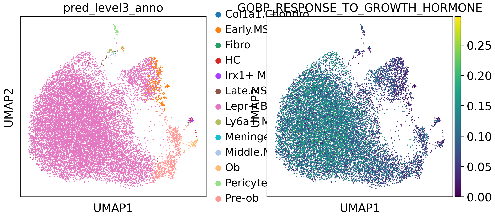
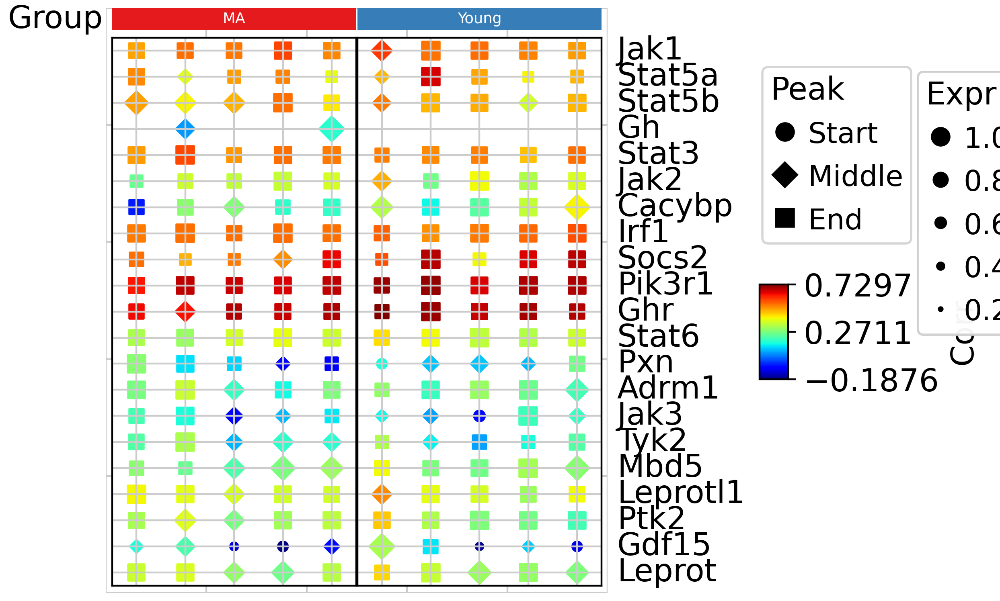

# TrajAtlas meets Gene Set Scoring 

## Introduction

When using gene set scoring algorithms like AUCells, you may wonder which genes in the gene set exhibit similar patterns to the overall trend. This capability can help you identify genes of interest within the gene set. TrajAtlas provides this functionality!

## Set up

```python
import numpy as np
import scanpy as sc
import pandas as pd
import TrajAtlas as tja
from pathlib import Path
import PyComplexHeatmap as pch
import decoupler
sc.settings.verbosity = 3
import matplotlib.pyplot as plt
plt.rcParams["figure.figsize"] = (4, 4)
```

    2024-06-16 16:23:25.825492: I tensorflow/core/platform/cpu_feature_guard.cc:210] This TensorFlow binary is optimized to use available CPU instructions in performance-critical operations.
    To enable the following instructions: AVX2 AVX512F FMA, in other operations, rebuild TensorFlow with the appropriate compiler flags.
    2024-06-16 16:23:26.671574: W tensorflow/compiler/tf2tensorrt/utils/py_utils.cc:38] TF-TRT Warning: Could not find TensorRT
    WARNING:root:In order to use the mouse gastrulation seqFISH datsets, please install squidpy (see https://github.com/scverse/squidpy).
    WARNING:root:In order to use sagenet models, please install pytorch geometric (see https://pytorch-geometric.readthedocs.io) and
     captum (see https://github.com/pytorch/captum).
    WARNING:root:mvTCR is not installed. To use mvTCR models, please install it first using "pip install mvtcr"
    WARNING:root:multigrate is not installed. To use multigrate models, please install it first using "pip install multigrate".

We load Anndata object previously processed.

```python
adata=sc.read("../data/3.19_adata_immediate_step1.h5ad")
```

## Pathway inference

We use [decoupler](https://decoupler-py.readthedocs.io/en/latest/) to infer pathway activity.

```python
def gmt_to_decoupler(pth: Path) -> pd.DataFrame:
    """
    Parse a gmt file to a decoupler pathway dataframe.
    """
    from itertools import chain, repeat

    pathways = {}

    with Path(pth).open("r") as f:
        for line in f:
            name, _, *genes = line.strip().split("\t")
            pathways[name] = genes

    return pd.DataFrame.from_records(
        chain.from_iterable(zip(repeat(k), v) for k, v in pathways.items()),
        columns=["geneset", "genesymbol"],
    )

go = gmt_to_decoupler("../../../../../../disk2/liuhuan/gingival_spatial/2024.3_spatial//data/m5.all.v2023.2.Mm.symbols (3).gmt")
decoupler.run_aucell(
    adata,
    go,
    source="geneset",
    target="genesymbol",
    use_raw=False,
)
```

In our paper, we have observed that growth hormone may play roles in Lepr+ BMSC differentiation. Now, we select GOBP_RESPONSE_TO_GROWTH_HORMONE pathway to show the activity.

```python
filtered_strings = [s for s in adata.obsm["aucell_estimate"].columns if "GROWTH_HORMONE" in s]
filtered_strings
```

    ['GOBP_GROWTH_HORMONE_RECEPTOR_SIGNALING_PATHWAY_VIA_JAK_STAT',
     'GOBP_GROWTH_HORMONE_SECRETION',
     'GOBP_POSITIVE_REGULATION_OF_GROWTH_HORMONE_SECRETION',
     'GOBP_REGULATION_OF_GROWTH_HORMONE_RECEPTOR_SIGNALING_PATHWAY',
     'GOBP_RESPONSE_TO_GROWTH_HORMONE',
     'GOMF_GROWTH_HORMONE_RECEPTOR_BINDING']

```python
pathway=["GOBP_RESPONSE_TO_GROWTH_HORMONE"]
adata.obs[pathway] = adata.obsm["aucell_estimate"][pathway]
```

```python
sc.pl.umap(adata,color = ["pred_level3_anno","GOBP_RESPONSE_TO_GROWTH_HORMONE"])
```



## Run TrajAtlas

```python
symbol = go['genesymbol'][go["geneset"]=="GOBP_RESPONSE_TO_GROWTH_HORMONE"]
goRes = tja.utils.getAttributeBase(adata,axis_key="GOBP_RESPONSE_TO_GROWTH_HORMONE",subsetGene= symbol,
                       sampleKey="sample",njobs=20)
```

    Processing Samples:   0%|          | 0/10 [00:00<?, ?it/s]
    Processing Samples: 100%|██████████| 10/10 [00:18<00:00,  1.81s/it]
    /home/gilberthan/anaconda3/envs/py311/lib/python3.11/site-packages/pandas/core/internals/blocks.py:329: RuntimeWarning: invalid value encountered in sqrt
      result = func(self.values, **kwargs)
    /home/gilberthan/anaconda3/envs/py311/lib/python3.11/site-packages/mudata/_core/mudata.py:491: UserWarning: Cannot join columns with the same name because var_names are intersecting.
      warnings.warn(

```python
dotDf=tja.utils.makeDotTable(goRes,gene=symbol,
                             sample=goRes.obs_names)
```

```python
groupObs=adata.obs[["sample","group"]].drop_duplicates()
groupObs.index=goRes.obs_names
col_ha = pch.HeatmapAnnotation(Group=pch.anno_simple(groupObs['group'],cmap='Set1',legend=False,add_text=True),
                           verbose=0,label_side='left',label_kws={'horizontalalignment':'right'})
```

```python
tja.utils.trajDotplot(dotDf,col_split=groupObs['group'],top_annotation=col_ha)
```

    Starting plotting..
    Starting calculating row orders..
    Reordering rows..
    Starting calculating col orders..
    Reordering cols..
    Plotting matrix..
    Warning: ratio is deprecated, please use max_s instead
    Using user provided max_s: 60
    Collecting legends..
    Plotting legends..
    Estimated legend width: 12.172222222222222 mm
    Incresing ncol
    Incresing ncol
    More than 3 cols is not supported
    Legend too long, generating a new column..



From the trajectory dot plot, we can observe that in the gene set, Irf1, Socs2, Pik3r1, and Ghr exhibit similar expression patterns to the overall activity. However, Pxn, Tyk2, and Gdf15 show distinct expression patterns.
Let's take a closer look at these genes.

```python
sc.pl.umap(adata,color=["Irf1", "Socs2","Pik3r1","Pxn","Tyk2","Gdf15"],use_raw=False,ncols=3)
```


These results confirm our findings. Therefore, we now understand that Irf1, Socs2, and Pik3r1 may be more crucial genes in this pathway.