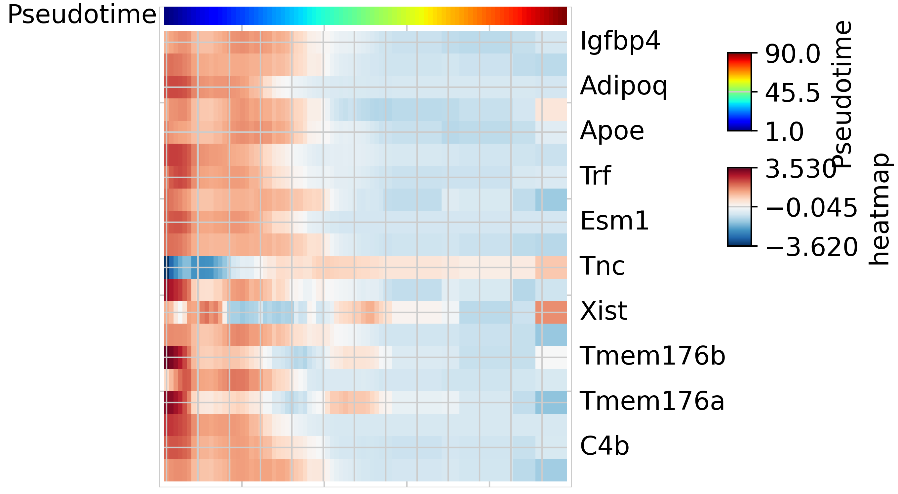
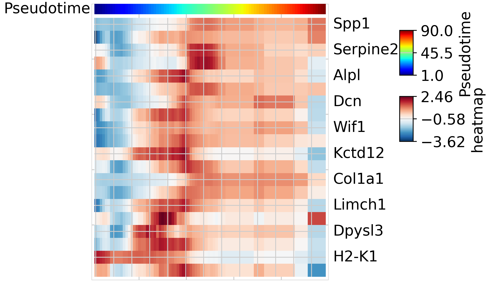
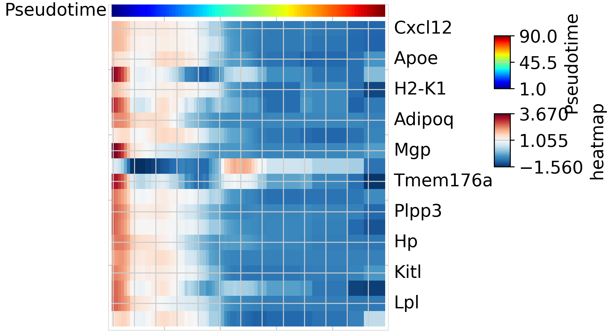
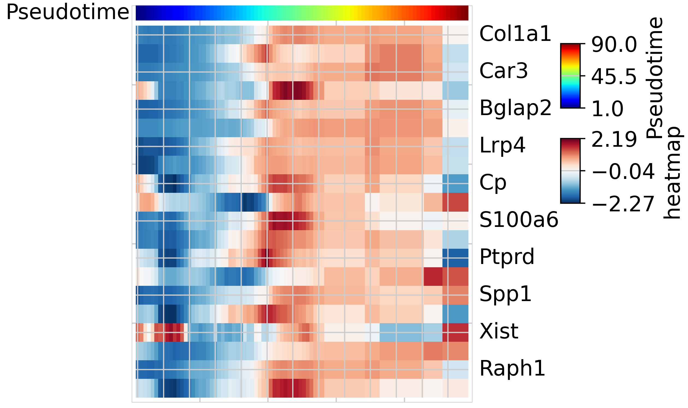

```python
import sys
sys.path.append("../../../../TrajAtlas/")
```

# Detect pseudotemporal gene modules with TRAVMap

## Setup


```python
from __future__ import annotations
import numpy as np
import scanpy as sc
import pandas as pd
import PyComplexHeatmap as pch
import TrajAtlas as tja
```


## Preprocess

We load the adata that we preprocessed before.


```python
adata=sc.read("../data/3.19_adata_immediate_step1.h5ad")
```

Initially, we utilized TrajDiff module to derive pseudotemporal gene expression profiles for each trajectory. The expression profiles were stored in `tdata.tdiff.uns["cpm_dict"]` slot.


```python
sc.pp.neighbors(adata, use_rep='scANVI', n_neighbors=80, n_pcs=15)
tdata=tja.TRAVMap.getTrajExpression(adata,sample_col="sample",group_col="group",time_col="pseduoPred",subsetLineage="pred_lineage_lepr")
```

     27%|██▋       | 323/1217 [01:42<04:42,  3.16it/s]
    /home/gilberthan/anaconda3/envs/scarches/lib/python3.8/site-packages/anndata/_core/anndata.py:117: ImplicitModificationWarning: Transforming to str index.
      warnings.warn("Transforming to str index.", ImplicitModificationWarning)
    100%|██████████| 1001/1001 [03:34<00:00,  4.66it/s]


<pre style="white-space:pre;overflow-x:auto;line-height:normal;font-family:Menlo,'DejaVu Sans Mono',consolas,'Courier New',monospace">Using edgeR to find CPM<span style="color: #808000; text-decoration-color: #808000">......</span>
</pre>


      0%|          | 0/1001 [00:00<?, ?it/s]2024-03-25 12:37:16.
    /home/gilberthan/anaconda3/envs/scarches/lib/python3.8/site-packages/pytorch_lightning/utilities/warnings.py:53: LightningDeprecationWarning: pytorch_lightning.utilities.warnings.rank_zero_deprecation has been deprecated in v1.6 and will be removed in v1.8. Use the equivalent function from the pytorch_lightning.utilities.rank_zero module instead.
     
     22%|██▏       | 216/1001 [01:44<04:53,  2.67it/s]
    100%|██████████| 1001/1001 [03:28<00:00,  4.81it/s]
    100%|██████████| 10/10 [00:00<00:00, 8405.42it/s]
 
    


## Gene module identifiaction

We identified pseudotemporal gene modules using Non-Negative Matrix Factorization (NMF) factorization. We recommended you have installed rpy2 to enable facotrization with RcppML. If RcppML was not detected, we will use sklearn.decomposition.NMF for factorization. By default, the component number of NMF was set to 15. You can choose proper number with [cross validation](https://www.zachdebruine.com/post/cross-validation-for-nmf-rank-determination/). The result are stored in `tdata.tdiff.uns["factor_dict"]` slot.


```python
tja.TRAVMap.find_gene_module(tdata)
```

    Detecting NMF factors in BmscAging_Young_Young5....
    Using RcppML for decomposition.....
    Detecting NMF factors in BmscAging_Young_Young1....
    Using RcppML for decomposition.....
    Detecting NMF factors in BmscAging_Young_MA3....
    Using RcppML for decomposition.....
    Detecting NMF factors in BmscAging_Young_Young3....
    Using RcppML for decomposition.....
    Detecting NMF factors in BmscAging_Young_MA2....
    Using RcppML for decomposition.....
    Detecting NMF factors in BmscAging_Young_MA5....
    Using RcppML for decomposition.....
    Detecting NMF factors in BmscAging_Young_Young4....
    Using RcppML for decomposition.....
    Detecting NMF factors in BmscAging_Young_Young2....
    Using RcppML for decomposition.....
    Detecting NMF factors in BmscAging_Young_MA1....
    Using RcppML for decomposition.....
    Detecting NMF factors in BmscAging_Young_MA4....
    Using RcppML for decomposition.....


## Plot pseudotemporal gene expression heatmap

We ultilized **pyComplexHeatmap** to plot top gene in gene module identified with NMF.


```python
tja.TRAVMap.plotGeneModule(tdata,sample="BmscAging_Young_MA4",factor="NMF_1",gene_num=20)
```

    Starting plotting..
    Starting calculating row orders..
    Reordering rows..
    Starting calculating col orders..
    Reordering cols..
    Plotting matrix..
    Collecting legends..
    Plotting legends..
    Estimated legend width: 7.5 mm


    

    


```python
tja.TRAVMap.plotGeneModule(tdata,sample="BmscAging_Young_MA4",factor="NMF_4",gene_num=20)
```

    Starting plotting..
    Starting calculating row orders..
    Reordering rows..
    Starting calculating col orders..
    Reordering cols..
    Plotting matrix..
    Collecting legends..
    Plotting legends..
    Estimated legend width: 7.5 mm


    

    


```python
tja.TRAVMap.plotGeneModule(tdata,sample="BmscAging_Young_MA4",factor="NMF_6",gene_num=20)
```

    Starting plotting..
    Starting calculating row orders..
    Reordering rows..
    Starting calculating col orders..
    Reordering cols..
    Plotting matrix..
    Collecting legends..
    Plotting legends..
    Estimated legend width: 7.5 mm


    

    


```python
tja.TRAVMap.plotGeneModule(tdata,sample="BmscAging_Young_MA4",factor="NMF_7",gene_num=20)
```

    Starting plotting..
    Starting calculating row orders..
    Reordering rows..
    Starting calculating col orders..
    Reordering cols..
    Plotting matrix..
    Collecting legends..
    Plotting legends..
    Estimated legend width: 7.5 mm


    

    


From the results above, it is evident that TRAVMap can identify gene modules that play functional roles within various differentiation stages.
