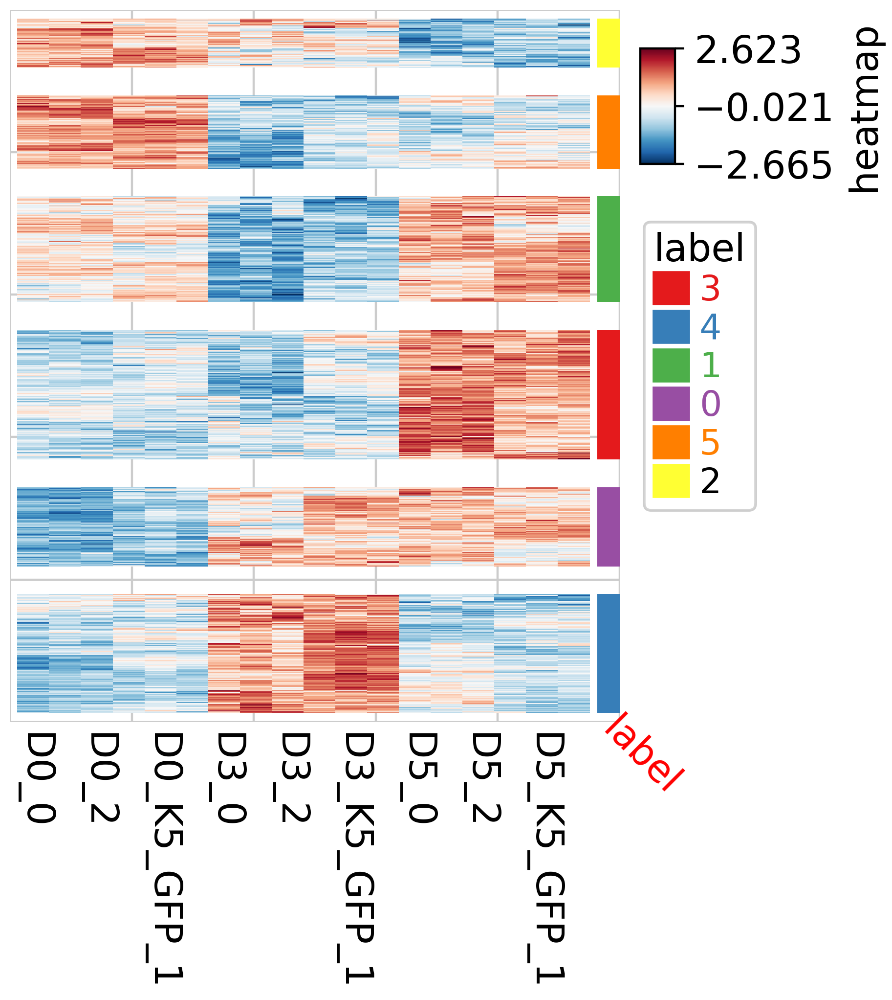
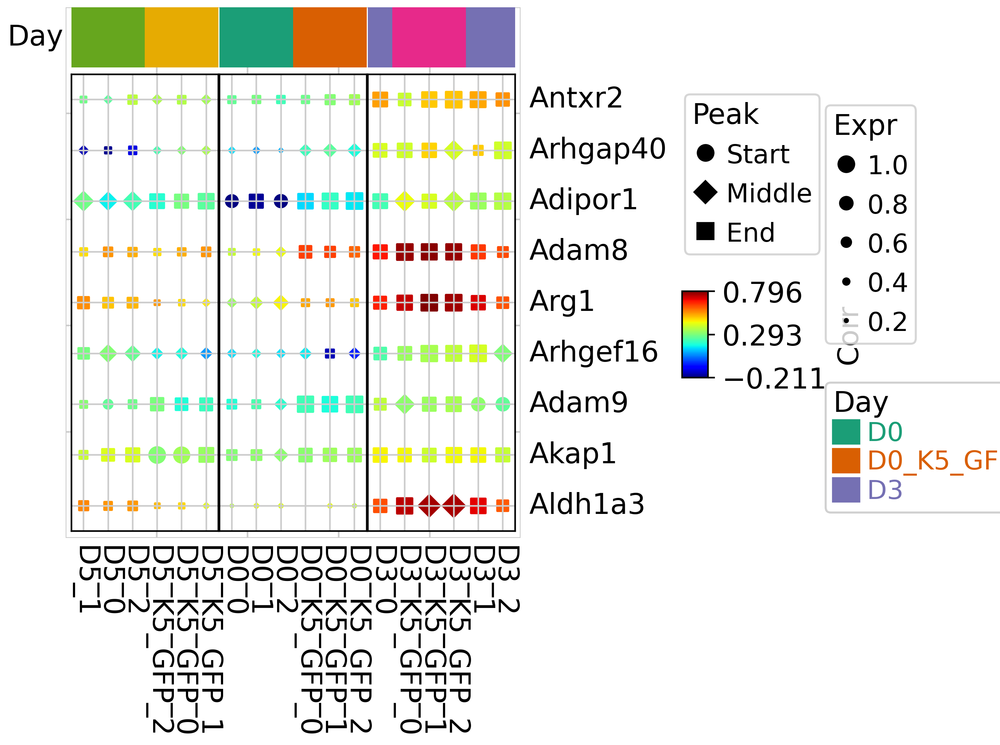

# TrajAtlas meetsSpatial Omic
## Setup

Here, we load TrajAtlas software and our gingival atlas datasets.


```python
import TrajAtlas as tja
import scanpy as sc
import numpy as np
import pandas as pd
```


```python
adata = sc.read("../important_processed_data/4.7_scMerge.h5ad")
```


```python
adata = adata[:,adata.var["pattern"].dropna().index]
sc.pp.normalize_total(adata, inplace=True)
sc.pp.log1p(adata)
adata.var["pattern"] = "pattern" + adata.var["pattern"].astype("int").astype("str")
```

    /home/zhanglab/mambaforge/envs/py311/lib/python3.11/site-packages/scanpy/preprocessing/_normalization.py:206: UserWarning: Received a view of an AnnData. Making a copy.
      view_to_actual(adata)


You need have following things to check out before you run this pipeline. 
1. The count matrix in adata.X should be normalized.
2. "Pattern" should be one of your `adata.var` slot. The algorithm to find patterns are not emmbeded in TrajAtlas. We recommend you to run with [SpatialDE](https://github.com/Teichlab/SpatialDE).
3. The value in adata.var.pattern should be in your `adata.obs.columns`


```python
adata.X[0:5,0:5].toarray()
```


    array([[0.94, 0.  , 0.  , 0.94, 0.  ],
           [0.  , 0.8 , 0.  , 0.8 , 0.8 ],
           [1.24, 0.  , 0.  , 1.24, 1.24],
           [0.  , 0.  , 0.  , 0.  , 2.46],
           [0.52, 0.86, 0.52, 0.  , 0.  ]])


```python
adata.var["pattern"]
```


    Lypla1      pattern0
    Tcea1       pattern5
    Rgs20       pattern1
    Atp6v1h     pattern7
    Rb1cc1      pattern6
                  ...   
    Ankrd34b    pattern7
    Kcng3       pattern7
    Chrna9      pattern2
    Matn3       pattern7
    Ak7         pattern6
    Name: pattern, Length: 10789, dtype: category
    Categories (8, object): ['pattern0', 'pattern1', 'pattern2', 'pattern3', 'pattern4', 'pattern5', 'pattern6', 'pattern7']


```python
adata
```


    AnnData object with n_obs × n_vars = 13056 × 10789
        obs: 'nCount_RNA', 'nFeature_RNA', 'percent.mt', 'orig.ident', 'celltype', 'idents', 'n_genes_by_counts', 'log1p_n_genes_by_counts', 'total_counts', 'log1p_total_counts', 'pct_counts_in_top_50_genes', 'pct_counts_in_top_100_genes', 'pct_counts_in_top_200_genes', 'pct_counts_in_top_500_genes', 'point', 'pattern0', 'pattern1', 'pattern2', 'pattern3', 'pattern4', 'pattern5', 'pattern6', 'pattern7'
        var: 'n_cells_by_counts', 'mean_counts', 'log1p_mean_counts', 'pct_dropout_by_counts', 'total_counts', 'log1p_total_counts', 'pattern', 'membership'
        uns: 'log1p'
        obsm: 'spatial'
        layers: 'logcounts'


## Statical test

In this step, we align the genes to the gene pattern axis, and calculate correlation, expression and peak. Because there are three groups, we use ANOVA to find differential genes. And we also applied [boostrap](https://en.wikipedia.org/wiki/Bootstrapping_(statistics)) to increase statical power.


```python
sc.pl.embedding(adata,color=['pattern0', 'pattern1', 'pattern2'],basis="spatial",size=70)
```


    

    


Here, we set bootstrap_iterations to be 3. You can increase this number, based on your need.


```python
mdata = utils.getAttributeGEP(adata,sampleKey  ="orig.ident",bootstrap_iterations = 3,njobs=20)
```
    Processing Samples: 100%|██████████| 6/6 [00:18<00:00,  3.06s/it]
    /home/gilberthan/anaconda3/envs/py311/lib/python3.11/site-packages/pandas/core/internals/blocks.py:393: RuntimeWarning: invalid value encountered in sqrt
      result = func(self.values, **kwargs)
    /home/gilberthan/anaconda3/envs/py311/lib/python3.11/site-packages/mudata/_core/mudata.py:491: UserWarning: Cannot join columns with the same name because var_names are intersecting.
      warnings.warn(

```python
mdata
```


<pre>MuData object with n_obs × n_vars = 18 × 9078
  3 modalities
    corr:	18 x 10789
      obs:	&#x27;sample&#x27;, &#x27;bootstrap&#x27;
      layers:	&#x27;raw&#x27;, &#x27;mod&#x27;
    expr:	18 x 10789
      obs:	&#x27;sample&#x27;, &#x27;bootstrap&#x27;
      layers:	&#x27;raw&#x27;, &#x27;mod&#x27;
    peak:	18 x 10789
      obs:	&#x27;sample&#x27;, &#x27;bootstrap&#x27;
      layers:	&#x27;raw&#x27;, &#x27;mod&#x27;</pre>


```python
design = {'sample' : ['D0','D0_K5_GFP', 'D3', 'D3_K5_GFP','D5', 'D5_K5_GFP'],
          'group': ["D0","D0","D3","D3","D5","D5"],
         "batch" : ["batch1", "batch2", "batch1", "batch2", "batch1", "batch2"]}
design = pd.DataFrame(design)
design=design.set_index("sample")
mdata["corr"].obs["group"]=np.array(design.loc[mdata["corr"].obs["sample"]]["group"])
```

This step return you a statical test dataframe. Here, we select 'P-value_corrected' < 0.01 as differential genes.


```python
anovadf = utils.attrANOVA(mdata["corr"],group_labels = mdata["corr"].obs["group"])
```


```python
sigGene = anovadf.Feature[anovadf['P-value_corrected']<0.01]
```

## Visualization

In this section, we ultilized two way to visualize these differnetial genes. 
1. Heatmap, where color represents correlation
2. Dotplot, where color represents correlation, size represents expression level, and shape represents peak.


```python
corrDf = pd.DataFrame(mdata["corr"].X)
corrDf.index = mdata["corr"].obs_names
corrDf.columns = mdata["corr"].var_names
corrDf = corrDf.T
```


```python
sigGene = np.intersect1d(corrDf.index,sigGene)
```


```python
def z_scale_row(row):
    return (row - row.mean()) / row.std()

# Apply the z-scaling function to each row of the DataFrame
scaled_df = corrDf.apply(z_scale_row, axis=1)
```


```python
scaled_df = scaled_df.loc[sigGene]
```


```python
scaled_df.shape
```

    (659, 18)


```python

from sklearn.cluster import KMeans

# Specify the number of clusters
num_clusters = 6

# Initialize the KMeans model
kmeans = KMeans(n_clusters=num_clusters)

# Fit the model to the data
kmeans.fit(scaled_df)

# Get the cluster labels
labels_filter = kmeans.labels_

labels_filter=labels_filter.astype("str")

labels_filter=pd.DataFrame(labels_filter)
labels_filter.index= scaled_df.index
```

    /home/gilberthan/anaconda3/envs/py311/lib/python3.11/site-packages/sklearn/cluster/_kmeans.py:1416: FutureWarning: The default value of `n_init` will change from 10 to 'auto' in 1.4. Set the value of `n_init` explicitly to suppress the warning
      super()._check_params_vs_input(X, default_n_init=10)


```python
import PyComplexHeatmap as pch
import matplotlib.pyplot as plt
row_ha =pch.HeatmapAnnotation(label=labels_filter,
                           label_side='bottom',
                           label_kws={'rotation':-45,'color':'red'},
                           axis=0)
pch.ClusterMapPlotter(scaled_df,show_colnames=True,col_cluster=False,row_split=labels_filter,
                      cmap="RdBu_r",row_split_gap=3,right_annotation=row_ha)
```

    Starting plotting..
    Starting calculating row orders..
    Reordering rows..
    Starting calculating col orders..
    Reordering cols..
    Plotting matrix..
    Starting plotting HeatmapAnnotations
    Collecting legends..
    Collecting annotation legends..
    Plotting legends..
    Estimated legend width: 17.767277777777778 mm


    <PyComplexHeatmap.clustermap.ClusterMapPlotter at 0x761a91933310>


    

    


```python
gene_to_show = labels_filter.index[labels_filter[0] == "4"][1:10]
```


```python
dotDf = tja.utils.makeDotTable(mdata,gene_to_show,sample= scaled_df.columns)
```


```python
anno_df
```


<div>
<style scoped>
    .dataframe tbody tr th:only-of-type {
        vertical-align: middle;
    }

    .dataframe tbody tr th {
        vertical-align: top;
    }

    .dataframe thead th {
        text-align: right;
    }
</style>
<table border="1" class="dataframe">
  <thead>
    <tr style="text-align: right;">
      <th></th>
      <th>sample</th>
      <th>bootstrap</th>
      <th>group</th>
    </tr>
  </thead>
  <tbody>
    <tr>
      <th>D0_0</th>
      <td>D0</td>
      <td>0</td>
      <td>D0</td>
    </tr>
    <tr>
      <th>D0_1</th>
      <td>D0</td>
      <td>1</td>
      <td>D0</td>
    </tr>
    <tr>
      <th>D0_2</th>
      <td>D0</td>
      <td>2</td>
      <td>D0</td>
    </tr>
    <tr>
      <th>D0_K5_GFP_0</th>
      <td>D0_K5_GFP</td>
      <td>0</td>
      <td>D0</td>
    </tr>
    <tr>
      <th>D0_K5_GFP_1</th>
      <td>D0_K5_GFP</td>
      <td>1</td>
      <td>D0</td>
    </tr>
    <tr>
      <th>D0_K5_GFP_2</th>
      <td>D0_K5_GFP</td>
      <td>2</td>
      <td>D0</td>
    </tr>
    <tr>
      <th>D3_0</th>
      <td>D3</td>
      <td>0</td>
      <td>D3</td>
    </tr>
    <tr>
      <th>D3_1</th>
      <td>D3</td>
      <td>1</td>
      <td>D3</td>
    </tr>
    <tr>
      <th>D3_2</th>
      <td>D3</td>
      <td>2</td>
      <td>D3</td>
    </tr>
    <tr>
      <th>D3_K5_GFP_0</th>
      <td>D3_K5_GFP</td>
      <td>0</td>
      <td>D3</td>
    </tr>
    <tr>
      <th>D3_K5_GFP_1</th>
      <td>D3_K5_GFP</td>
      <td>1</td>
      <td>D3</td>
    </tr>
    <tr>
      <th>D3_K5_GFP_2</th>
      <td>D3_K5_GFP</td>
      <td>2</td>
      <td>D3</td>
    </tr>
    <tr>
      <th>D5_0</th>
      <td>D5</td>
      <td>0</td>
      <td>D5</td>
    </tr>
    <tr>
      <th>D5_1</th>
      <td>D5</td>
      <td>1</td>
      <td>D5</td>
    </tr>
    <tr>
      <th>D5_2</th>
      <td>D5</td>
      <td>2</td>
      <td>D5</td>
    </tr>
    <tr>
      <th>D5_K5_GFP_0</th>
      <td>D5_K5_GFP</td>
      <td>0</td>
      <td>D5</td>
    </tr>
    <tr>
      <th>D5_K5_GFP_1</th>
      <td>D5_K5_GFP</td>
      <td>1</td>
      <td>D5</td>
    </tr>
    <tr>
      <th>D5_K5_GFP_2</th>
      <td>D5_K5_GFP</td>
      <td>2</td>
      <td>D5</td>
    </tr>
  </tbody>
</table>
</div>


```python
anno_df = mdata["corr"].obs
```


```python
col_ha = pch.HeatmapAnnotation(
                           Day=pch.anno_simple(anno_df,cmap='Dark2',legend=True,add_text=False),
                           verbose=0,label_side='left',label_kws={'horizontalalignment':'right'})
tja.utils.trajDotplot(dotDf, show_colnames=True,top_annotation = col_ha,spines=True,col_split = anno_df.group)
```

    Starting plotting..
    Starting calculating row orders..
    Reordering rows..
    Starting calculating col orders..
    Reordering cols..
    Plotting matrix..
    Warning: ratio is deprecated, please use max_s instead
    Using user provided max_s: 60
    Collecting legends..
    Plotting legends..
    Estimated legend width: 29.5811 mm
    Incresing ncol
    Incresing ncol
    More than 3 cols is not supported
    Legend too long, generating a new column..
    Incresing ncol

    

    
