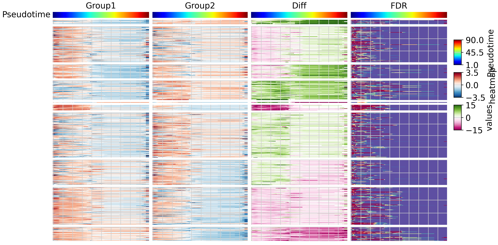
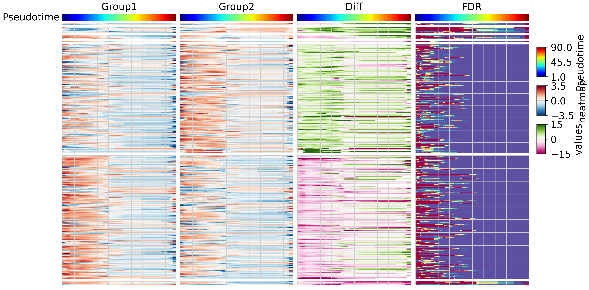

# Differential Expression with TrajAtlas

## Setup


```python
import numpy as np
import scanpy as sc
import pandas as pd
import TrajAtlas as tja
from sklearn.cluster import KMeans
sc.settings.verbosity = 3
import matplotlib.pyplot as plt
plt.rcParams["figure.figsize"] = (7, 7)
```


```python
tdiff=tja.diff.Tdiff()
```

## Datasets

In this tutorial, we continue with the adata we created in OPCST projecting


```python
adata=sc.read("../data/3.19_adata_immediate_step1.h5ad")
```

We started with milo standard pipeline, which was described in `Differential Abundance with TrajAtlas`.


```python
tdata = tdiff.load(adata)
sc.pp.neighbors(tdata['rna'], use_rep='scANVI', n_neighbors=80, n_pcs=15)
tdiff.make_nhoods(tdata['rna'], prop=0.10)
tdata =  tdiff.count_nhoods(tdata, sample_col="sample")
```

    computing neighbors
        finished: added to `.uns['neighbors']`
        `.obsp['distances']`, distances for each pair of neighbors
        `.obsp['connectivities']`, weighted adjacency matrix (0:00:29)


    /home/gilberthan/anaconda3/envs/scarches/lib/python3.8/site-packages/anndata/_core/anndata.py:117: ImplicitModificationWarning: Transforming to str index.
      warnings.warn("Transforming to str index.", ImplicitModificationWarning)


For every neighborhood, we generated pseudobulk. You need to specify which column in "adata.obs" represents the sample, group, and pseudotime, respectively.


```python
pseudobulk=tdiff.make_pseudobulk_parallel(mdata=tdata,sample_col="sample",group_col="group",time_col="pseduoPred",njob=25,min_cell=4)
```

    100%|██████████| 1001/1001 [03:57<00:00,  4.21it/s]


The differential expression pipeline follows steps similar to those in "Differential Abundance." Specifically, we utilized a Generalized Linear Model (GLM) with **edgeR** to compute the differential expression for each neighborhood. Subsequently, we mapped the results onto the pseudotime axis, dividing it into n intervals and applying a binomial model to each interval. Additionally, we performed permutation null hypothesis testing by shuffling group labels to obtain lambda. The comprehensive differentiation outcomes are stored in pseudobulk.var.overall_gene_p, while the within-interval differential expression results are stored in pseudobulk.varm.exprPoint. The false discovery rate (FDR) within each interval is stored in pseudobulk.varm.gene_p_adj. Moreover, the expression profiles of each group are stored in pseudobulk.varm.group1_cpm and pseudobulk.varm.group2_cpm.


```python
tdiff.de(tdata,design="~group",model_contrasts="groupYoung-groupMA",njob=-1,fix_libsize=False,shuffle_times=5)
```


<pre style="white-space:pre;overflow-x:auto;line-height:normal;font-family:Menlo,'DejaVu Sans Mono',consolas,'Courier New',monospace">Detecting differential expression in neighborhoods<span style="color: #808000; text-decoration-color: #808000">......</span>
</pre>


<pre style="white-space:pre;overflow-x:auto;line-height:normal;font-family:Menlo,'DejaVu Sans Mono',consolas,'Courier New',monospace">Using edgeR to find DEG<span style="color: #808000; text-decoration-color: #808000">......</span>
</pre>


      0%|          | 1/1001 [00:01<19:11,  1.15s/it]2024-03-22 20:04:04.127204: W tensorflow/compiler/tf2tensorrt/utils/py_utils.cc:38] TF-TRT 

<pre style="white-space:pre;overflow-x:auto;line-height:normal;font-family:Menlo,'DejaVu Sans Mono',consolas,'Courier New',monospace"><span style="color: #008080; text-decoration-color: #008080; font-weight: bold">547</span> differential genes were detected!
</pre>


```python
tdata
```


<pre>MuData object with n_obs × n_vars = 15079 × 22076
  3 modalities
    rna:	15079 x 22076
      obs:	&#x27;orig.ident&#x27;, &#x27;nCount_RNA&#x27;, &#x27;nFeature_RNA&#x27;, &#x27;percent_mito&#x27;, &#x27;RNA_snn_res.0.5&#x27;, &#x27;seurat_clusters&#x27;, &#x27;group&#x27;, &#x27;sample&#x27;, &#x27;pseduoPred&#x27;, &#x27;pred_level1_anno&#x27;, &#x27;pred_level2_anno&#x27;, &#x27;pred_level3_anno&#x27;, &#x27;pred_level4_anno&#x27;, &#x27;pred_level5_anno&#x27;, &#x27;pred_level6_anno&#x27;, &#x27;pred_level7_anno&#x27;, &#x27;pred_lineage_fibro&#x27;, &#x27;pred_lineage_lepr&#x27;, &#x27;pred_lineage_msc&#x27;, &#x27;pred_lineage_chondro&#x27;, &#x27;lineageSum&#x27;, &#x27;Cell&#x27;, &#x27;nhood_ixs_random&#x27;, &#x27;nhood_ixs_refined&#x27;, &#x27;nhood_kth_distance&#x27;
      var:	&#x27;vst.mean&#x27;, &#x27;vst.variance&#x27;, &#x27;vst.variance.expected&#x27;, &#x27;vst.variance.standardized&#x27;, &#x27;vst.variable&#x27;
      uns:	&#x27;group_colors&#x27;, &#x27;neighbors&#x27;, &#x27;pred_level2_anno_colors&#x27;, &#x27;pred_level3_anno_colors&#x27;, &#x27;pred_lineage_chondro_colors&#x27;, &#x27;pred_lineage_fibro_colors&#x27;, &#x27;pred_lineage_lepr_colors&#x27;, &#x27;pred_lineage_msc_colors&#x27;, &#x27;umap&#x27;, &#x27;nhood_neighbors_key&#x27;
      obsm:	&#x27;X_umap&#x27;, &#x27;scANVI&#x27;, &#x27;nhoods&#x27;
      layers:	&#x27;counts&#x27;
      obsp:	&#x27;connectivities&#x27;, &#x27;distances&#x27;
    tdiff:	10 x 1001
      var:	&#x27;index_cell&#x27;, &#x27;kth_distance&#x27;, &#x27;time&#x27;, &#x27;range_down&#x27;, &#x27;range_up&#x27;
      uns:	&#x27;sample_col&#x27;
      varm:	&#x27;groupMA&#x27;, &#x27;groupYoung&#x27;, &#x27;Accept&#x27;, &#x27;logChange&#x27;, &#x27;null_mean&#x27;
    pseudobulk:	9120 x 22076
      obs:	&#x27;sample&#x27;, &#x27;group&#x27;, &#x27;pseduoPred&#x27;, &#x27;nhoods_index&#x27;
      var:	&#x27;overall_gene_p&#x27;
      uns:	&#x27;sample_col&#x27;, &#x27;group_col&#x27;, &#x27;time_col&#x27;, &#x27;var1&#x27;, &#x27;var2&#x27;, &#x27;shuffle_times&#x27;, &#x27;sum&#x27;
      varm:	&#x27;PValue&#x27;, &#x27;logFC&#x27;, &#x27;logCPM&#x27;, &#x27;FDR&#x27;, &#x27;F&#x27;, &#x27;groupMA&#x27;, &#x27;groupYoung&#x27;, &#x27;SPFDR&#x27;, &#x27;null_mean&#x27;, &#x27;nullPoint&#x27;, &#x27;truePoint&#x27;, &#x27;exprPoint&#x27;, &#x27;group1_cpm&#x27;, &#x27;group2_cpm&#x27;, &#x27;gene_p_adj&#x27;</pre>


## Plot

Group genes into gene clusters based on their pseudotemporal expression patterns. Currently, we offer two clustering strategies: Kmeans and Stage.

In `Kmeans` mode, genes are grouped using Kmeans clustering, which identifies differential expression patterns between two groups.

In `Stage` mode, genes are grouped based on the stage (early or late) at which they exhibit differential expression (up or down).


```python
kmean_label= tja.diff.split_gene(tdata,mode="Kmean")
```

    /home/gilberthan/anaconda3/envs/scarches/lib/python3.8/site-packages/sklearn/cluster/_kmeans.py:1412: FutureWarning: The default value of `n_init` will change from 10 to 'auto' in 1.4. Set the value of `n_init` explicitly to suppress the warning
      super()._check_params_vs_input(X, default_n_init=10)
    /home/gilberthan/Desktop/disk1/limb/3.9_wt_integrate/7.6_software/3.15_trajAtlas/script/../../../../TrajAtlas/TrajAtlas/TrajDiff/trajdiff_utils.py:157: SettingWithCopyWarning: 
    A value is trying to be set on a copy of a slice from a DataFrame
    
    See the caveats in the documentation: https://pandas.pydata.org/pandas-docs/stable/user_guide/indexing.html#returning-a-view-versus-a-copy
      mdata["rna"].var["Kmeans"].loc[labels.index]=np.array(labels["geneGroup"])


We then utilized **pyComplexHeatmap** to generate a four-panel heatmap. The heatmap represents pseudotemporal gene expression for group 1, pseudotemporal gene expression for group 2, differential expression, and false discovery rate, respectively.


```python
tdiff.plotDE(tdata,row_split=kmean_label)
```

    Starting plotting..
    Starting calculating row orders..
    Reordering rows..
    Starting calculating col orders..
    Reordering cols..
    Plotting matrix..
    Collecting legends..
    Starting plotting..
    Starting calculating col orders..
    Reordering cols..
    Plotting matrix..
    Collecting legends..
    Estimated legend width: 7.5 mm


    <Figure size 1200x800 with 0 Axes>


    <Figure size 1200x800 with 0 Axes>


    <Figure size 1200x800 with 0 Axes>


    <Figure size 1200x800 with 0 Axes>


    <Figure size 1200x800 with 0 Axes>


    

    


Based on the results, we observe that gene groups cluster according to their expression patterns.


```python
stage_label= tja.diff.split_gene(tdata,mode="Stage")
```

    /home/gilberthan/Desktop/disk1/limb/3.9_wt_integrate/7.6_software/3.15_trajAtlas/script/../../../../TrajAtlas/TrajAtlas/TrajDiff/trajdiff_utils_12.py:198: SettingWithCopyWarning: 
    A value is trying to be set on a copy of a slice from a DataFrame
    
    See the caveats in the documentation: https://pandas.pydata.org/pandas-docs/stable/user_guide/indexing.html#returning-a-view-versus-a-copy
      mdata["rna"].var["Stage"].loc[labels.index]=np.array(labels)


```python
tdiff.plotDE(tdata,row_split=stage_label)
```

    Starting plotting..
    Starting calculating row orders..
    Reordering rows..
    Starting calculating col orders..
    Reordering cols..
    Plotting matrix..
    Collecting legends..
    Starting plotting..
    Starting calculating col orders..
    Reordering cols..
    Plotting matrix..
    Collecting legends..
    Estimated legend width: 7.5 mm


    <Figure size 1200x800 with 0 Axes>


    <Figure size 1200x800 with 0 Axes>


    <Figure size 1200x800 with 0 Axes>


    <Figure size 1200x800 with 0 Axes>


    <Figure size 1200x800 with 0 Axes>


    

    


From the results, it's evident that gene groups exert their functions at different differentiation stages. However, it's worth noting that due to the limited number of cells at the late stage, we were unable to detect many genes at this stage."
